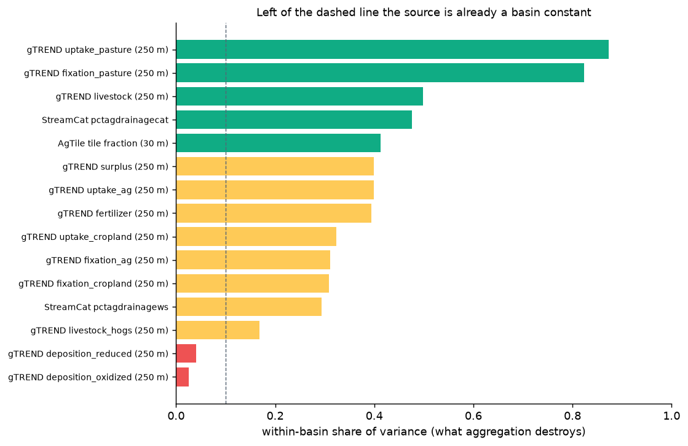
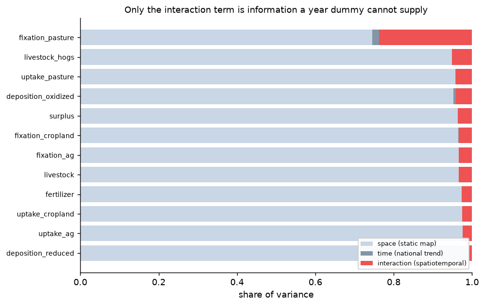
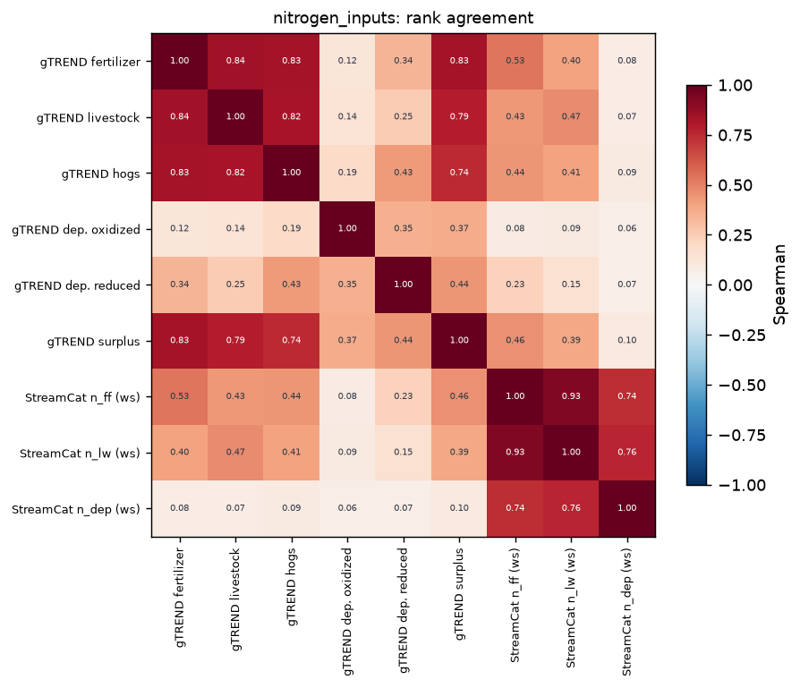
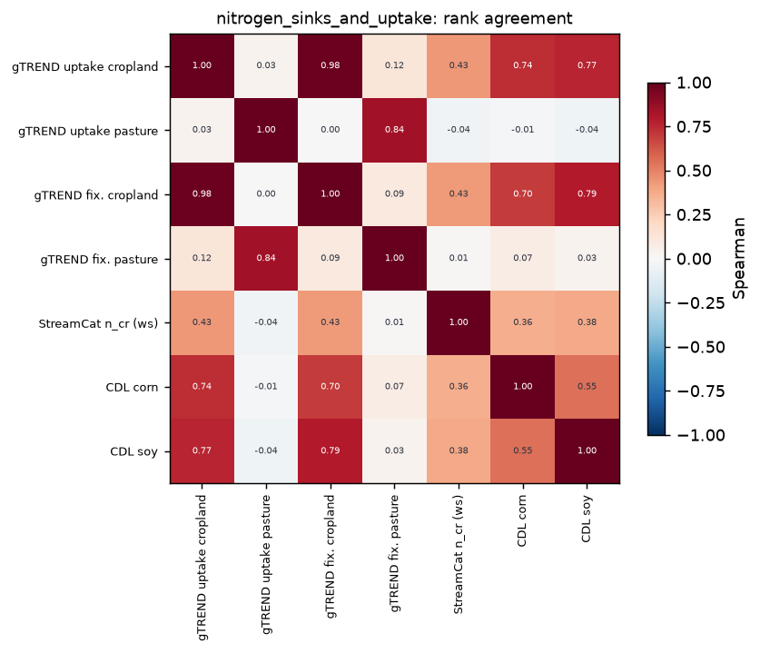
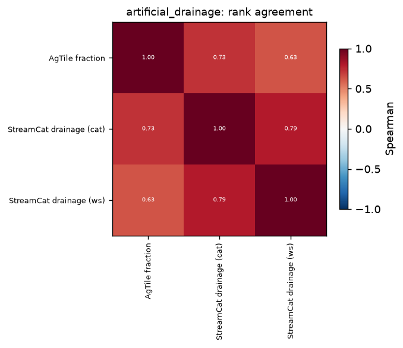
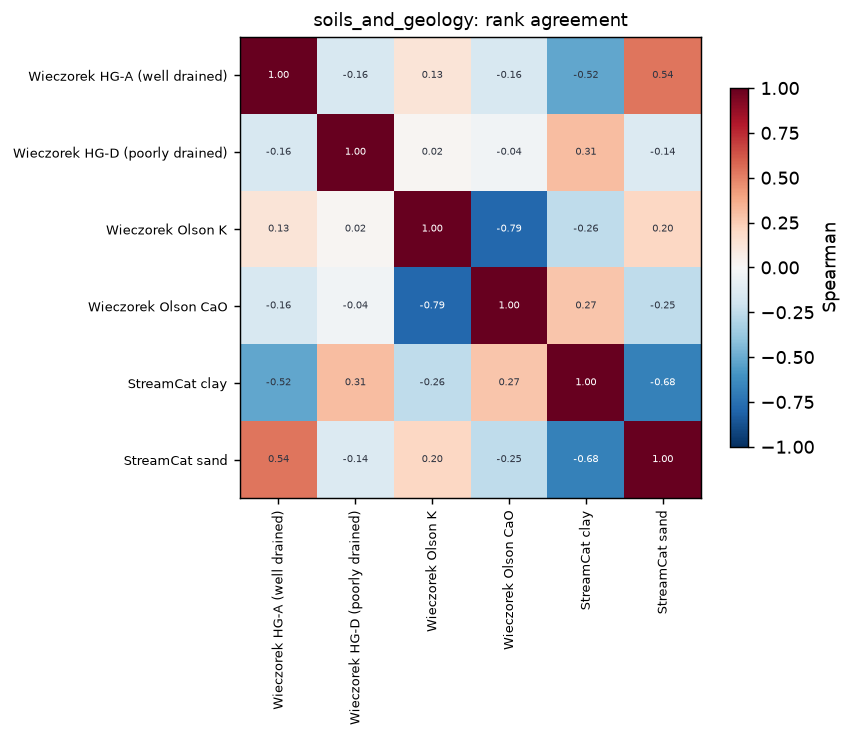
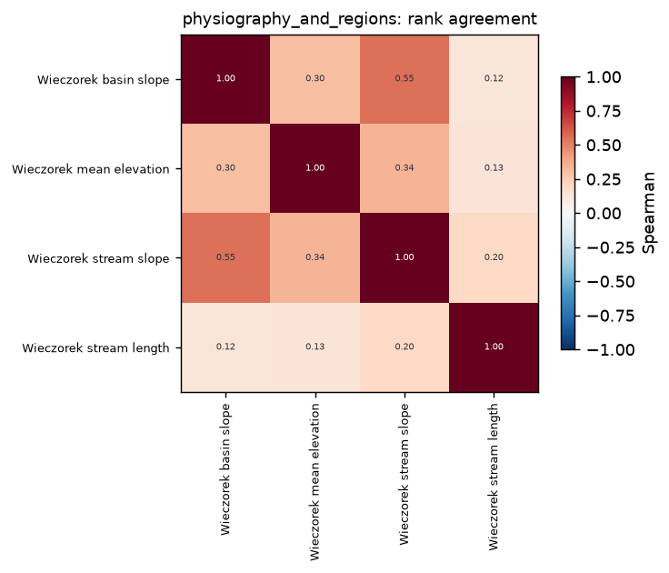
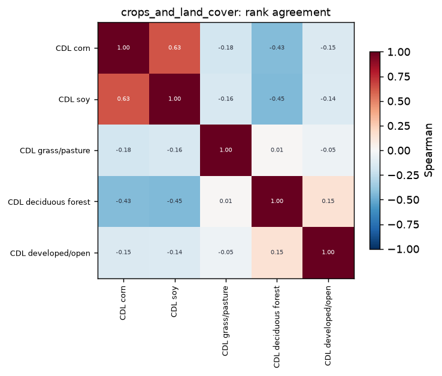

# Data insights

_Generated 2026-08-31 17:06 by `python -m data.insights`. **Never hand-edit this file** — it is regenerated after every pipeline run. Interpretation lives in the inventory chapter's `## Data Themes` section, which cites this._

---

## Tier 0 — what is on disk against what the access layer exposes

**111.9 GB across 39,113 files** in 4 store layers.

| layer | substore | n_files | GB | status | readers |
|---|---|---|---|---|---|
| acquired | weather | 95 | 29.74 | reachable | drought_columns, get_drought, get_weather |
| raw | crops | 1 | 25.93 | intermediate (consumed by the build) |  |
| acquired | attributes | 66 | 12.47 | reachable | attribute_columns, get_attributes |
| derived | covariates | 388 | 10.96 | intermediate (consumed by the build) |  |
| raw | water | 215 | 7.27 | intermediate (consumed by the build) |  |
| acquired | water | 7745 | 7.13 | reachable | get_native |
| raw | gTREND | 219 | 5.96 | intermediate (consumed by the build) |  |
| published | comid_features | 10 | 5.49 | reachable | get_covariates, get_weather |
| acquired | network | 4 | 2.41 | reachable | accumulate, get_network, snap |
| acquired | facilities | 22 | 1.95 | intermediate (consumed by the build) |  |
| derived | water | 15125 | 1.2 | intermediate (consumed by the build) |  |
| published | water | 7539 | 0.64 | reachable | get_record |
| raw | karst | 1 | 0.28 | intermediate (consumed by the build) |  |
| raw | agtile | 2 | 0.18 | intermediate (consumed by the build) |  |
| acquired | metadata | 144 | 0.12 | intermediate (consumed by the build) |  |
| acquired | authority_basins | 7123 | 0.07 | ORPHANED |  |
| raw | comid_attrs | 3 | 0.05 | ORPHANED |  |
| acquired | wqx | 41 | 0.03 | reachable | discrete_nitrate_states, get_discrete_nitrate |
| acquired | seed_basins | 357 | 0.02 | intermediate (consumed by the build) |  |
| raw | basins | 1 | 0.0 | intermediate (consumed by the build) |  |
| published | sensors | 1 | 0.0 | reachable | get_sensors |
| derived | sensors | 1 | 0.0 | intermediate (consumed by the build) |  |
| derived | review | 4 | 0.0 | intermediate (consumed by the build) |  |
| derived | aoe | 1 | 0.0 | intermediate (consumed by the build) |  |
| derived | scrub_tallies | 1 | 0.0 | intermediate (consumed by the build) |  |
| published | proximity | 1 | 0.0 | reachable | get_proximity |
| derived | proximity | 1 | 0.0 | intermediate (consumed by the build) |  |
| published | quality | 1 | 0.0 | reachable | get_quality |
| acquired | verification_report | 1 | 0.0 | intermediate (consumed by the build) |  |

### Reachable by nobody

**Three states, not two.** A substore with no access reader is not a finding on its own: `acquired/facilities` has none and is read by `derive/structures`, whose product is published — flagging it would send a reader to fix something that works, and one false row makes the true ones easy to dismiss. The finding is data reachable by **nobody**: no access function, and no mention anywhere in the live `data/` source.

| layer | substore | n_files | GB |
|---|---|---|---|
| acquired | authority_basins | 7123 | 0.072 |
| raw | comid_attrs | 3 | 0.053 |

`derived/` is intermediate by design — publication projects it into `published/` — so a derived substore without a reader is the architecture working. `src/` is excluded from the consumption scan on purpose: it is the retired predecessor, and data referenced only there is precisely what this is built to surface.

### The access surface

| function | signature | declared_paths |
|---|---|---|
| accumulate | (comid: 'int') | acquired/network |
| attribute_columns | (source: 'str' = 'streamcat') -> 'list[str]' | acquired/attributes |
| discrete_nitrate_states | () -> 'list[str]' | acquired/wqx |
| drought_columns | () -> 'list[str]' | acquired/weather/pentad |
| get_attributes | (comids, columns=None, source: 'str' = 'streamcat') -> 'pd.DataFrame' | acquired/attributes |
| get_covariates | (comids, products=('crops', 'nutrients', 'agtile'), years=None, remap=None) -> 'dict' | published/comid_features |
| get_discrete_nitrate | (states=None, bbox=None, window=None, characteristics=None, include_qc: 'bool' = False, activity_types=None) -> 'pd.DataFrame' | acquired/wqx |
| get_drought | (wset_or_comids, window, variables=('spei90d', 'spi90d', 'eddi90d', 'pdsi')) -> 'pd.DataFrame' | acquired/weather/pentad |
| get_native | (uid: 'str', channels=None, window=None) -> 'pd.DataFrame' | acquired/water/native |
| get_network | (layer: 'str' = 'flowlines') | acquired/network |
| get_proximity | (max_sep_m: 'float | None' = None) -> 'pd.DataFrame' | published/proximity.parquet |
| get_quality | () -> 'pd.DataFrame' | published/quality.parquet |
| get_record | (code_or_uid: 'str', channels=None, window=None) -> 'pd.DataFrame' | published/water |
| get_sensors | (columns=None) -> 'pd.DataFrame' | published/sensors.parquet |
| get_weather | (wset_or_comids, window, variables=('pr', 'tmmx', 'tmmn', 'pet', 'srad')) -> 'pd.DataFrame' | acquired/weather/daily, published/comid_features/weights_gridmet.parquet |
| snap | (lat: 'float', lon: 'float') -> 'dict' | acquired/network |

---

## Themes

| theme | verdict | sources | members | candidates |
|---|---|---|---|---|
| artificial_drainage | covered | 3 | agtile, wieczorek_hydrologic_modifications, streamcat | sekellick_manure |
| crops_and_land_cover | covered | 2 | cdl_crops, wieczorek_land_cover | — |
| instream_processing | covered | 3 | nhdplus_vaa, dams_on_reach, waterbodies | sparrow_delfrac |
| nitrogen_inputs | covered | 7 | gtrend_fertilizer, gtrend_livestock, gtrend_fixation, gtrend_deposition, streamcat_n_families, wieczorek_chemical, dmr_loads | sparrow_shares |
| nitrogen_sinks_and_uptake | covered | 3 | gtrend_uptake, streamcat_n_families, cdl_crops | — |
| physiography_and_regions | covered | 2 | wieczorek_regions, wieczorek_topographic | — |
| point_sources_and_structures | covered | 4 | dmr_loads, facilities, dams, nid | — |
| soils_and_geology | covered | 4 | wieczorek_soils, wieczorek_geology, streamcat, karst_weary_doctor | — |
| surface_hydrology_and_flow | covered | 3 | nhdplus_vaa, discharge_channel, modelled_discharge | — |
| water_quality_observations | covered | 4 | usgs, iwqis, mpca, wqx_discrete | — |
| antecedent_moisture_and_snow | thin | 1 | gridmet_drought_pentad | snodas, nldas2 |
| conservation_practices | thin | 1 | wieczorek_bmp | census_of_ag_cover_crops |
| groundwater_and_residence_time | thin | 1 | wieczorek_hydrologic | — |
| legacy_nitrogen | thin | 1 | streamcat_n_families | — |
| meteorological_forcing | thin | 1 | gridmet_daily | aorc_hourly |

**Thin or absent themes are the finding.** These are enumerated from the domain rather than from our holdings, so a short list here means a real gap in what the project can see, not a gap in the registry:
- **antecedent_moisture_and_snow** (thin) — The state of the profile BEFORE the rain: soil moisture, snowpack, melt, multi-scale drought. Flush magnitude depends on it and precipitation alone does not measure it.
- **conservation_practices** (thin) — Cover crops, tillage, buffers, terraces, bioreactors -- the interventions meant to reduce delivery. Poorly observed at any useful resolution.
- **groundwater_and_residence_time** (thin) — Recharge, water-table depth, baseflow index, subsurface contact time -- the slow pathway, and where legacy nitrogen lives.
- **legacy_nitrogen** (thin) — Nitrogen accumulated in soil and groundwater from past decades, released long after application. Central in the literature and barely represented here.
- **meteorological_forcing** (thin) — Precipitation, temperature, radiation, humidity, wind -- the drivers that move and transform nitrogen day to day.

---

## Tier 1 — what each source is

| source | theme | native_grain | cadence | span | lineage | store |
|---|---|---|---|---|---|---|
| gridmet_daily | meteorological_forcing | 1/24 deg cell (~19 km2) | daily | 1979-present | gauge interpolation + PRISM sharpening | acquired/weather/daily |
| gridmet_drought_pentad | antecedent_moisture_and_snow | 1/24 deg cell | pentad (5-day) | 1979-present | derived from gridMET's own pr/pet | acquired/weather/pentad |
| cdl_crops | crops_and_land_cover | 30 m pixel | annual | 2008-2025 | USDA NASS classification of Landsat/Sentinel | derived/covariates/crops.parquet |
| gtrend_fertilizer | nitrogen_inputs | 250 m pixel | annual | 2000-2017 | TREND county totals downscaled by an agricultural mask | raw/gTREND/Agriculture_Fertilizer |
| gtrend_livestock | nitrogen_inputs | 250 m pixel | annual | 2000-2017 | TREND county livestock inventories downscaled | raw/gTREND/Lvst_Sum |
| gtrend_fixation | nitrogen_inputs | 250 m pixel | annual | 2000-2017 | TREND, crop-area based | raw/gTREND/*_Fixation |
| gtrend_uptake | nitrogen_sinks_and_uptake | 250 m pixel | annual | 2000-2017 | TREND, yield based | raw/gTREND/*_Uptake |
| gtrend_deposition | nitrogen_inputs | 250 m pixel | annual | 2000-2017 | NADP/CMAQ deposition surfaces | raw/gTREND/Atmospheric_* |
| streamcat_n_families | nitrogen_inputs | NHDPlus catchment | annual | 1987-2017 | TREND county totals -- SHARES AN ANCESTOR WITH gtrend_* | acquired/attributes/streamcat.parquet |
| wieczorek_chemical | nitrogen_inputs | NHDPlus catchment | static / multi-vintage | varies | USGS compilations | acquired/attributes/wieczorek_chemical_* |
| dmr_loads | point_sources_and_structures | permitted outfall | monthly | 2008-2026 | self-reported effluent monitoring (ICIS-NPDES) | derived/covariates/dmr_loads.parquet |
| agtile | artificial_drainage | 30 m pixel | static (2017) | 2017 | Census of Ag county tile stats + NLCD + SRTM slope + SSURGO drainage class | derived/covariates/agtile.parquet |
| wieczorek_hydrologic_modifications | artificial_drainage | NHDPlus catchment | static (1992) | 1992 | USGS compilation -- SHARES SSURGO WITH agtile | acquired/attributes/wieczorek_hydrologic_modifications_* |
| nhdplus_vaa | surface_hydrology_and_flow | reach | static | — | NHDPlus V2 value-added attributes | acquired/network |
| discharge_channel | surface_hydrology_and_flow | sensor | sub-daily to daily | 2008-present | measured (USGS/IWQIS/MPCA) | published/water |
| modelled_discharge | surface_hydrology_and_flow | sensor | daily | 2008-present | modelled (projects/discharge-test) | projects/discharge-test/results |
| wieczorek_hydrologic | groundwater_and_residence_time | NHDPlus catchment | static | — | USGS flow-pathway compilation | acquired/attributes/wieczorek_hydrologic_* |
| wieczorek_soils | soils_and_geology | NHDPlus catchment | static | — | STATSGO/SSURGO | acquired/attributes/wieczorek_soils_* |
| wieczorek_geology | soils_and_geology | NHDPlus catchment | static | — | Olson lithology and others | acquired/attributes/wieczorek_geology_* |
| wieczorek_regions | physiography_and_regions | NHDPlus catchment | static | — | HLR / Fenneman / EPA ecoregions | acquired/attributes/wieczorek_regions_* |
| dams | point_sources_and_structures | dam point | static | — | National Inventory of Dams | derived/covariates/dams.parquet |
| facilities | point_sources_and_structures | outfall point | static | — | ICIS-NPDES + CWNS | derived/covariates/facilities.parquet |
| usgs | water_quality_observations | sensor | sub-daily to daily | 2008-present | measured | published/water |
| iwqis | water_quality_observations | sensor | sub-daily | 2008-present | measured | published/water |
| mpca | water_quality_observations | sensor | sub-daily | 2008-present | measured | published/water |

### Do not double-count

Pairs that are **not independent**, established by reading lineage rather than by correlating values. No statistic can distinguish *agrees because both are right* from *agrees because both are the same data*, so this list is traced by hand and is the reason `lineage` is a column above.

| a | b | why |
|---|---|---|
| streamcat_n_families | gtrend_fertilizer | both descend from the same TREND county fertilizer estimates; StreamCat aggregates them to catchments, gTREND downscales them by an agricultural mask |
| streamcat_n_families | gtrend_livestock | same TREND ancestry, same relationship |
| agtile | wieczorek_hydrologic_modifications | AgTile is derived FROM SSURGO drainage class and slope, which the Wieczorek soils and topographic themes also carry directly |
| gtrend_fixation:fixation_ag | gtrend_fixation:fixation_cropland + fixation_pasture | an exact arithmetic sum, verified to 0.01 -- the total is the parts |
| gtrend_uptake:uptake_ag | gtrend_uptake:uptake_cropland + uptake_pasture | an exact arithmetic sum, verified to 0.01 |
| gtrend_livestock:livestock | gtrend_livestock:livestock_hogs | hogs are a SUBSET of the livestock total, not a partner |

---

## Tier 2 — comparison within a theme

### Does the source even reach the cohort?

Asked first, because a redundancy or agreement statistic computed on the rows a source happens to cover says nothing about the rows it does not. Span is reported against the water record's 2008–2026 window, so a source ending in 2017 reads as the slowly-varying descriptor it is rather than as a contemporaneous covariate.

| source | reached | of | frac | span | verdict |
|---|---|---|---|---|---|
| crops (CDL) | 19567 | 20000 | 0.9784 | 2008-2025 | reaches the cohort |
| nutrients (gTREND) | 19562 | 20000 | 0.9781 | 2000-2017 | reaches the cohort |
| agtile | 19567 | 20000 | 0.9784 | static | reaches the cohort |
| StreamCat (latest) | 19565 | 20000 | 0.9782 | latest vintage | reaches the cohort |
| StreamCat (series) | 19565 | 20000 | 0.9782 | 1987-2016 | reaches the cohort |

### Does a source vary *within* a catchment?

The decisive cheap test, and the one that generalises: a source whose native cell is larger than the catchment it is reduced to delivers a **basin-level constant**, whatever resolution it advertises. Answerable from geometry alone — no data read.

| product | cell_km2 | frac_smaller_than_cell | verdict |
|---|---|---|---|
| CDL (30 m) | 0.0009 | 0.0 | resolves within catchments |
| AgTile (30 m) | 0.0009 | 0.0 | resolves within catchments |
| gTREND (250 m) | 0.0625 | 0.0941 | resolves within catchments |
| AORC (1 km) | 1.0 | 0.4072 | resolves within catchments |
| SNODAS (1 km) | 1.0 | 0.4072 | resolves within catchments |
| TerraClimate (~4 km) | 16.0 | 0.9839 | catchment-level constant |
| gridMET (1/24 deg) | 19.0 | 0.9885 | catchment-level constant |
| NLDAS-2 (1/8 deg) | 146.0 | 0.9998 | catchment-level constant |
| GRACE (~300 km) | 90000.0 | 1.0 | catchment-level constant |

**Do not pay for spatial resolution in a gridded covariate at this grain.** It is why OpenET's 30 m advantage over TerraClimate's 4 km is worth nothing here, and why comparing those two on resolution compares a quantity neither delivers.

#### Measured, not inferred from cell size

The table above answers the question from geometry and never reads a value, so it cannot see a source whose values are smooth for reasons other than cell size. This one decomposes the actual catchment-grain variance into between-basin and within-basin parts over whole sampled HUC8s — whole basins, because a scattered catchment sample would have almost no two catchments sharing a basin and the within-basin term would be undefined. **`within` is the share a basin-level aggregate destroys**, so a source near zero is already a basin constant and its native resolution buys nothing after aggregation.

| source | n | basins | within | between | verdict |
|---|---|---|---|---|---|
| gTREND deposition_oxidized (250 m) | 81931 | 60 | 0.0254 | 0.9746 | basin constant after aggregation |
| gTREND deposition_reduced (250 m) | 81936 | 60 | 0.0404 | 0.9596 | basin constant after aggregation |
| gTREND livestock_hogs (250 m) | 81927 | 60 | 0.1679 | 0.8321 | mostly basin-level |
| StreamCat pctagdrainagews | 82075 | 60 | 0.2931 | 0.7069 | mostly basin-level |
| gTREND fixation_cropland (250 m) | 81927 | 60 | 0.3084 | 0.6916 | mostly basin-level |
| gTREND fixation_ag (250 m) | 81927 | 60 | 0.3108 | 0.6892 | mostly basin-level |
| gTREND uptake_cropland (250 m) | 81927 | 60 | 0.3235 | 0.6765 | mostly basin-level |
| gTREND fertilizer (250 m) | 81927 | 60 | 0.3945 | 0.6055 | mostly basin-level |
| gTREND uptake_ag (250 m) | 81927 | 60 | 0.3993 | 0.6007 | mostly basin-level |
| gTREND surplus (250 m) | 81927 | 60 | 0.3994 | 0.6006 | mostly basin-level |
| AgTile tile fraction (30 m) | 82152 | 60 | 0.413 | 0.587 | resolves within basins |
| StreamCat pctagdrainagecat | 81918 | 60 | 0.4764 | 0.5236 | resolves within basins |
| gTREND livestock (250 m) | 81927 | 60 | 0.4983 | 0.5017 | resolves within basins |
| gTREND fixation_pasture (250 m) | 81927 | 60 | 0.8236 | 0.1764 | resolves within basins |
| gTREND uptake_pasture (250 m) | 81927 | 60 | 0.8731 | 0.1269 | resolves within basins |

### Does a source add anything the others do not?

Measured on the nutrient budget over a seeded random sample of **19,567 catchments** (352,206 catchment-years). Pairwise correlation cannot answer this — two products can each correlate weakly with a third and still be jointly redundant with it — so the measure is each product's **R² regressed on all the others**. High means the product is reconstructible from what we already hold.

| product | r2_given_others | verdict |
|---|---|---|
| uptake_cropland | 0.9881 | reconstructible from the pool |
| fixation_cropland | 0.9737 | reconstructible from the pool |
| fertilizer | 0.9585 | reconstructible from the pool |
| surplus | 0.9111 | largely implied |
| livestock | 0.9048 | largely implied |
| deposition_reduced | 0.8487 | largely implied |
| uptake_pasture | 0.843 | largely implied |
| deposition_oxidized | 0.8023 | largely implied |
| fixation_pasture | 0.6294 | carries its own signal |
| livestock_hogs | 0.5338 | carries its own signal |

The two gTREND closure totals are excluded: they are their own parts summed, so including them would report a perfect fit and say nothing. Rank correlations for the most-agreeing pairs, reported alongside and never instead of the above:

| a | b | spearman |
|---|---|---|
| fixation_ag | fixation_cropland | 0.999 |
| uptake_ag | uptake_cropland | 0.994 |
| fixation_ag | uptake_cropland | 0.994 |
| fixation_cropland | uptake_cropland | 0.993 |
| fertilizer | uptake_cropland | 0.989 |
| fixation_ag | uptake_ag | 0.989 |

### Is an annual product actually a time series?

Variance on the (catchment × year) panel splits into a between-catchment part (a static map), a between-year part (a national trend applied everywhere), and the interaction — and **only the interaction is spatiotemporal information**, the part a model cannot get from a static covariate plus a year dummy.

| product | space | time | interaction | verdict |
|---|---|---|---|---|
| deposition_reduced | 0.9939 | 0.0001 | 0.006 | static map + year dummy |
| uptake_ag | 0.9757 | 0.0005 | 0.0238 | static map + year dummy |
| uptake_cropland | 0.9743 | 0.0007 | 0.0251 | static map + year dummy |
| fertilizer | 0.9736 | 0.0004 | 0.026 | static map + year dummy |
| livestock | 0.9666 | 0.0001 | 0.0333 | static map + year dummy |
| fixation_ag | 0.9656 | 0.0008 | 0.0336 | static map + year dummy |
| fixation_cropland | 0.965 | 0.0009 | 0.0341 | static map + year dummy |
| surplus | 0.9634 | 0.0003 | 0.0363 | static map + year dummy |
| deposition_oxidized | 0.9522 | 0.0066 | 0.0413 | static map + year dummy |
| uptake_pasture | 0.958 | 0.0005 | 0.0415 | static map + year dummy |
| livestock_hogs | 0.9483 | 0.0003 | 0.0515 | mostly spatial |
| fixation_pasture | 0.7452 | 0.0177 | 0.2371 | spatiotemporal |

### Redundancy within a theme

One representative column per source per theme, rank-correlated. **The block structure is the message, not any single coefficient.** A theme names sources rather than columns, so the correspondence is a hand-written judgement in `sources.THEME_PROBES` — picking one column over another is a claim about what the theme means, which is not derivable.

**nitrogen_inputs** — 9 probes

**nitrogen_sinks_and_uptake** — 7 probes

**artificial_drainage** — 3 probes

**soils_and_geology** — 6 probes

**physiography_and_regions** — 4 probes

**crops_and_land_cover** — 5 probes

**Themes with no matrix, and why** — the reason differs, so it is given per theme rather than as one sentence.

| theme | reason |
|---|---|
| meteorological_forcing | one source (gridMET); a covariate cannot be redundant with itself |
| antecedent_moisture_and_snow | one source (gridMET pentad drought, 25 aggregates); SNODAS would be the second |
| legacy_nitrogen | one source (StreamCat `n_leg`) |
| surface_hydrology_and_flow | its second member is the discharge CHANNEL, a time series rather than a catchment-keyed column, so the two are not commensurable here |
| groundwater_and_residence_time | one source (Wieczorek Hydrologic) |
| instream_processing | its members are SPARSE point layers (dams, waterbodies) where absent is not zero, so a correlation over catchments would be measuring where structures exist rather than whether the sources agree |
| point_sources_and_structures | same reason — sparse point layers, where a shared zero is an absence of structures rather than an agreement |
| conservation_practices | one source, and the theme is a known observational gap |
| water_quality_observations | its members are the observations themselves, not covariates; agreement between them is the identity layer's question |

### Is absence random?

`absent is not zero` protects the join; it does not tell a model that a gap is informative. Comparing the catchment areas of covered against uncovered reaches says whether the gap is structured.

| store | n | missing | frac_missing | median_area_present | median_area_missing |
|---|---|---|---|---|---|
| streamcat | 20000 | 435 | 0.0217 | 1.389 | 0.0 |
| streamcat_series | 20000 | 435 | 0.0217 | 1.389 | 0.0 |

#### Is nullity predictable from *position*?

The stronger form of the question, and the one that decides whether imputing a gap smuggles geography into the feature. `share_in_worst_decile` is the fraction of nulls falling in the tenth of basins with the highest null rates — **0.10 is what a random scatter gives**. The decile is chosen after seeing the data, so the statistic is biased upward when nulls are few; rows with fewer nulls than three per basin are reported inconclusive rather than structured.

| family | column | null_rate | n_null | share_in_worst_decile | verdict |
|---|---|---|---|---|---|
| wieczorek_soils_cat | CAT_HGA | 0.0032 | 499 | 0.8357 | structured — imputation smuggles geography |
| wieczorek_geology_cat | CAT_HUNT1 | 0.0001 | 18 | 1.0 | inconclusive — only 18 null(s) over 120 basins |
| wieczorek_hydrologic_cat | CAT_RECHG | 0.0027 | 431 | 1.0 | structured — imputation smuggles geography |
| wieczorek_topographic_cat | CAT_STRM_DENS | 0.0329 | 5187 | 0.2082 | mildly clustered |
| streamcat | (row absent) | 0.0199 | 3154 | 0.3256 | mildly clustered |

### Not measured, deliberately

**There is no tier measuring predictive power.** That is a property of a task, not of the data, and recording it here would turn an inventory into a record of one model's preferences on one cohort at one date.
