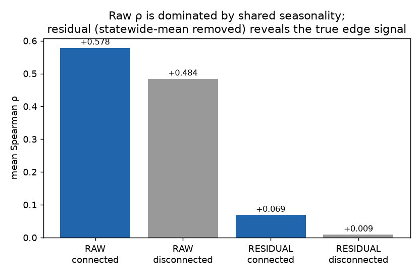
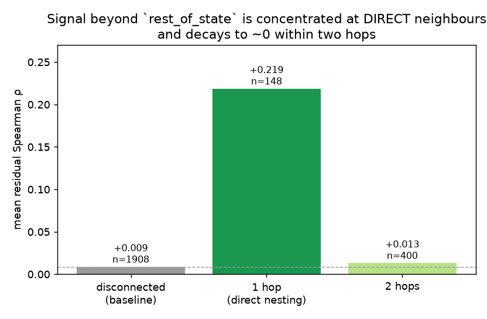
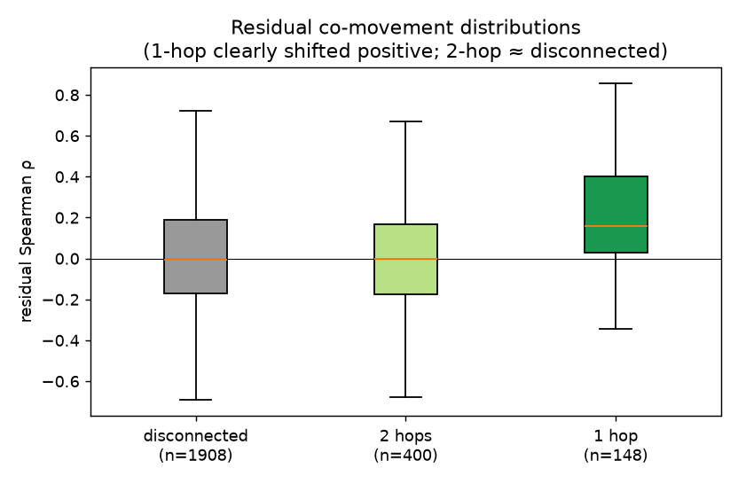
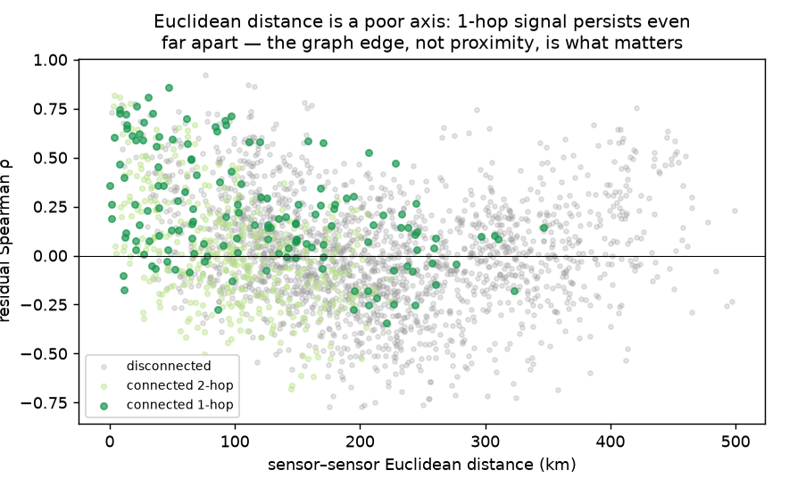
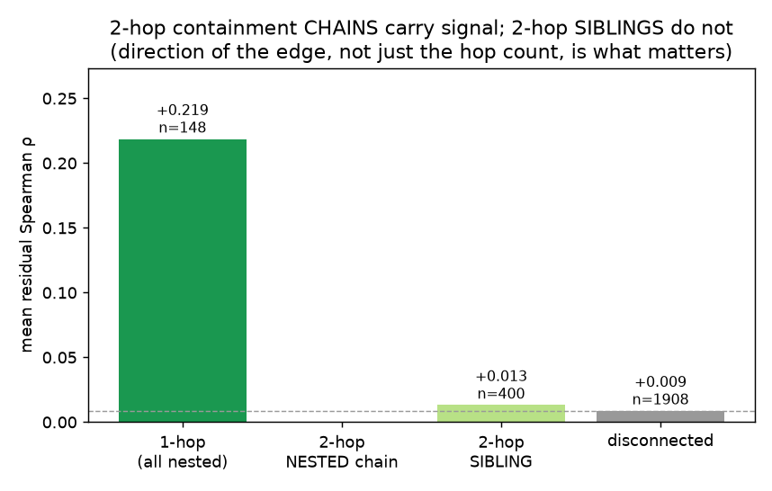
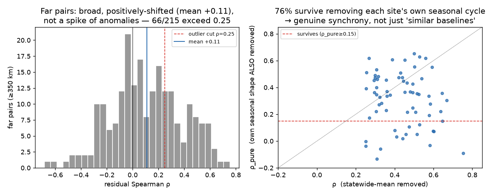
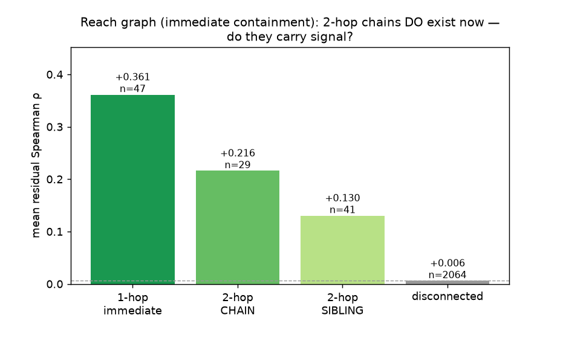
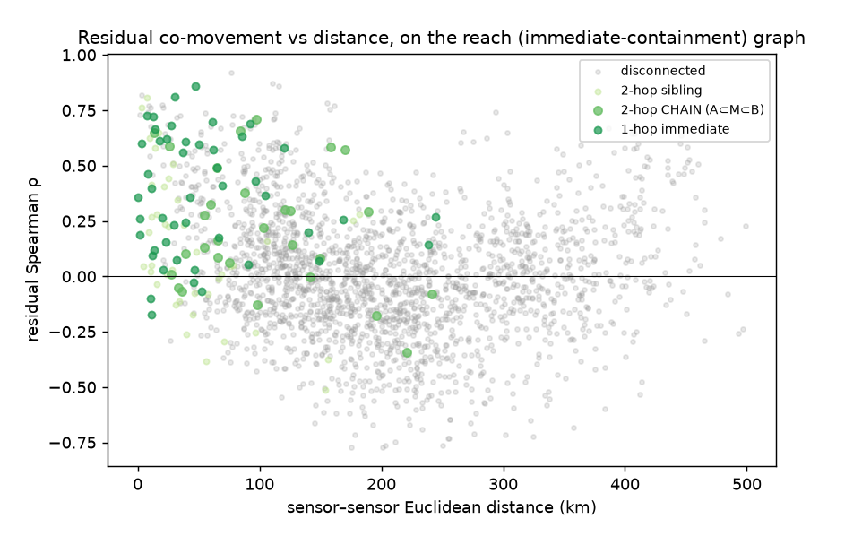
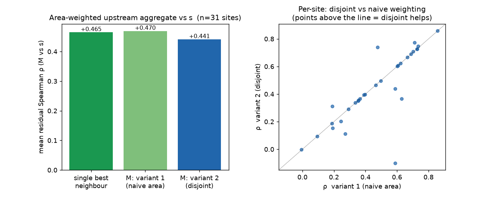
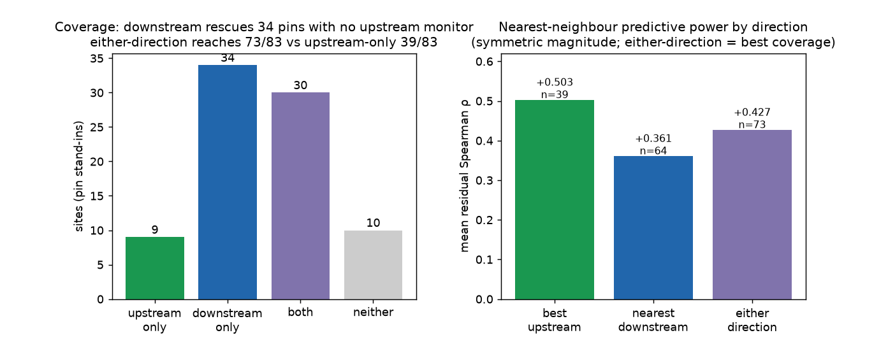

# R12 precondition — does hydrological connection carry nitrate signal?

**The go/no-go test for the sensor-graph / GNN direction.** Run on the 85 existing Iowa sensors
(83 usable), no new data. Reproduce with `python run_all.py`. Date span 2008–2026.

---

## Recommendations (read first)

**Verdict (revised after Follow-up C): GO for neighbour features. On the correct reach graph the
signal propagates *multi-hop* with graded decay, so a GNN is NOT ruled out — but test hand-engineered
1-hop + 2-hop neighbour features in a GBDT first; reach for a GNN only if the learned-propagation
residual proves to matter.**

Hydrological connection carries real nitrate signal beyond `rest_of_state`, and on the
immediate-containment (reach) graph it **decays gradually along the network**: adjacent nesting
**+0.36**, one intermediate (2-hop chain) **+0.22**, 3+ hops **+0.10** — and a 2-hop chain retains
**+0.086** even after controlling for the intermediate node, i.e. some signal is *not* screened off
by the nearest neighbour. (⚠ An earlier version of this test used a transitively-**closed**
containment graph that artifactually collapsed every chain to a single hop and wrongly showed
"2-hop ≈ 0, no GNN." That was a graph-construction artifact, not hydrology — see **Follow-up C**,
which is the authoritative result. The recommendations below are updated accordingly.)

**Suggested new features (each justified by an experiment above):**

- **Nearest monitored-neighbour anomaly, either direction.** Feed the nitrate *anomaly* (deviation from the statewide daily mean) of the closest monitored site on the reach network — upstream or downstream — as a predictor of the target/pin. On the immediate-containment graph this nearest-neighbour anomaly carries residual Spearman up to +0.50 (Follow-up C/E), versus ≈0 for unconnected sites, i.e. real signal beyond what `rest_of_state` already gives.
- **Inverse-area-ratio (dilution) weight on that neighbour.** Down-weight a neighbour whose basin is much larger or smaller than the target's, so a size-matched neighbour dominates over a distant integrator. Residual correlation is governed by the drainage-area ratio (Spearman ≈ −0.65): size-matched nested pairs co-move at +0.60 while a small basin inside a huge one collapses to +0.10.
- **Neighbour-direction flag (upstream vs downstream).** Tag whether the nearest neighbour lies upstream or downstream, since the two differ in lag structure and typical dilution. The nearest downstream neighbour predicts more weakly than the best upstream one (+0.36 vs +0.50), purely because the nearest gauge below a pin is usually a much larger, more diluted river — a distinction the model should condition on.
- **Second-neighbour (2-hop chain) anomaly.** Add the anomaly of the next monitored site one intermediate away along the reach network (A⊂M⊂B). Two-hop chains still carry +0.22 residual co-movement, and +0.086 of it survives even after controlling for the intermediate node — genuine multi-hop signal a single 1-hop feature misses.
- **Neighbour-coverage scalars: count of monitored neighbours and distance to the nearest.** Add how many monitored neighbours a pin has (either direction) and the network distance to the closest, so the model knows how much neighbour information is actually available. Coverage is highly variable — 88% of pins have a neighbour, 12% have none and must fall back to static features — so these scalars let the tree switch regimes and drive the confidence/siting map.

1. **Build a "nearest monitored neighbour, *either direction*, dilution-weighted" feature (do this —
   low effort, GBDT).** The single highest-value construct: nearest monitored neighbour on the
   immediate-containment (reach) graph — **upstream *or* downstream** — its nitrate anomaly, weighted
   by inverse area-ratio, plus a direction flag and a 2-hop (one-intermediate) term. Downstream nearly
   doubles coverage (**88% of pins vs 47% upstream-only**, Follow-up E) at +0.43 residual ρ. The
   current `rest_of_state` statewide mean throws all of this away. Iowa first; use the
   transitive-reduction graph, not raw point-in-polygon containment.

2. **A GNN is a legitimate candidate — test it *after* the multi-hop GBDT, not instead of it.** The
   signal genuinely propagates multi-hop (graded decay, and +0.086 survives controlling for the
   intermediate), so a GNN's learned variable-depth propagation now has something real to carry —
   the earlier "no-GNN" call was a graph artifact. BUT most of the 2-hop signal (~0.12 of 0.21) is
   *mediated* by the intermediate, so a GBDT with explicit 1-hop + 2-hop neighbour features should
   capture the bulk of it. Build that first; justify the GNN only if the residual learned-propagation
   gain (the +0.086-flavoured part, and deeper chains) proves to matter in LOSO/LOFO.

3. **Separately test the *non-nitrate* sensor features — the untested half of your vision.** This
   test covered nitrate→nitrate only. Discharge / DO / pH at directly-connected *upstream gauges*
   were not measured here and could still add 1-hop value (the verified C–Q result — b = +0.61,
   nitrate mobilizes with flow — makes upstream discharge a plausible 1-hop predictor). If they do,
   that's the real feature win, and it's *still* GBDT-shaped: a 1-hop aggregation, not deep MPNN.

4. **Frame the product as the confidence / sensor-siting map.** The added value is confined to pins
   that *have* a directly-connected monitored neighbour, and degrades gracefully to the current
   static model where they don't. "Which pins have a close connected monitor?" is exactly a coverage
   map — the decision-support deliverable that survives regardless of the accuracy verdict.

5. **Temper expectations against the actual bottleneck.** The +0.21 is *anomaly* co-movement — the
   **timing/within-site channel** (`within_r2` 0.42, already good), not the **between-site ranker**
   (`between_r2` 0.21, the bottleneck). So this improves the channel that isn't broken. Genuinely
   useful for the deployed-network-assist product, but do not expect it to move headline LOFO much.

**Net:** the report closed the GNN door too early — on the proper reach graph the signal is genuinely
multi-hop. But Follow-up D shows a **single dominant-upstream-neighbour feature captures the bulk** of
what an area-weighted aggregate of *all* upstream sites does (mean residual ρ +0.465 vs +0.470), so
the practical play is one strong neighbour feature in a GBDT; multi-hop aggregation and a GNN are
marginal add-ons to justify only if that increment converts to real LOSO/LOFO gain.

## Evolution of the findings (how the conclusion moved)

Read the follow-ups in order — the headline flipped twice as the method tightened:

1. **Pairwise, point-in-polygon graph (Findings, A).** "Signal is 1-hop only; 2-hop ≈ 0; **no GNN**."
   Looked decisive.
2. **Why the exceptions (fig4 interpretation, B).** Correlation ≠ connectivity: nested pairs weaken
   by *dilution* (area ratio), disconnected pairs correlate via *shared weather/land-use* — most of
   which the model already has.
3. **Reach graph correction (C).** The 1-hop-only result was a **construction artifact**: the graph
   was transitively closed, collapsing chains to one hop. On the immediate-containment (reach) graph
   the signal **propagates multi-hop** (+0.36 → +0.22 → +0.10) and survives controlling for the
   intermediate (+0.086) → **a GNN is back on the table.**
4. **Area-weighted aggregate (D).** The aggregate upstream predictor is strong (+0.47) but **≈ the
   single best neighbour**, and the double-count-correcting *disjoint* weighting is slightly *worse*,
   not better. → multi-hop/aggregation is real but **marginal beyond one dominant neighbour**.
5. **Downstream + either-direction (E).** Adding *downstream* neighbours (symmetric per-edge) nearly
   **doubles coverage** (47% → 88% of pins) — the biggest practical lever found. → the feature is
   "nearest monitored neighbour, *either direction*."

**Trajectory:** "local, no GNN" → "multi-hop is real, GNN plausible" → "one dominant neighbour
captures most of it" → "and looking *downstream* too is what makes it deployable almost everywhere."

---

## Method (one paragraph)

For every pair of sites with ≥365 concurrent observed days (2,456 pairs), we compute the Spearman
rank correlation of daily-max nitrate two ways: **raw**, and **residual** — after subtracting the
cross-site daily mean (the `rest_of_state` statewide level the model already carries). Pairs are
classified **connected** (basins hydrologically nested, via the `basin_containment_graph`) vs
**disconnected**, and connected pairs are split by graph **hop distance** (1 = direct nesting, 2 =
one basin between). The residual contrast is the decisive one: it asks whether a neighbour predicts a
site's nitrate *anomaly* beyond the statewide signal. (`01_build_pairs.py` → `02_analyze.py` →
`03_plots.py`; `pairs.parquet`, `summary.json`.)

## Findings

**Power is fine — the premise is testable on Iowa alone.** 548 connected (nested) pairs (148 direct,
400 two-hop) vs 1,908 disconnected. No need to wait for the national network to answer this.

**Raw correlation is misleading — it's mostly shared seasonality.** Connected pairs correlate +0.58,
disconnected +0.48: both high, because every Iowa site rides the same spring-flush cycle. The +0.095
raw "excess" overstates the hydrological signal.

**Residual is the real test, and it localizes the signal to direct neighbours.** After removing the
statewide mean, disconnected pairs collapse to **+0.009 ≈ 0** — i.e. for an unconnected site, a
random other site's anomaly tells you nothing `rest_of_state` didn't already. Directly-nested (1-hop)
pairs retain **+0.219**; two-hop pairs fall back to **+0.013**. The signal is real and one-hop-deep.

**Euclidean distance is the wrong axis — it's the graph edge, not proximity, that matters.** 1-hop
pairs keep their positive residual co-movement even when the sensors are far apart (nested sites
strung along one big river), while nearby-but-disconnected pairs sit at zero. This is *why* the
hydrological graph is the right structure — but, again, only at one hop.

## Caveats

- **Correlational, not held-out.** ρ is a diagnostic (as the report treats R12), not a skill number.
- **Nitrate→nitrate only.** The non-nitrate features (discharge/DO/pH) central to the broader vision
  are untested here — recommendation 3.
- **Timing channel, not the between-site gap.** Anomaly co-movement ≠ site-level ranking (rec 5).
- **Distance-matched view is muddied** (see `summary.json`): "connected" mixes strong 1-hop with
  null 2-hop, and disconnected pairs at <25 km are few (n=8) and unrepresentative — the clean signal
  is the hop breakdown, not the distance bins.

---

## Follow-up A — is 2-hop "one basin contained in the other" different? (`04_directed_2hop.py`)

**The category is empty by construction — and that sharpens the main finding.** Splitting 2-hop
pairs into *nested chains* (a directed upstream→downstream path exists) vs *siblings* (share a
downstream parent, neither contains the other) finds **zero** nested chains. The reason is
structural: containment is **transitive** — if A ⊂ M ⊂ B then A's sensor is inside B's basin, so a
**direct 1-hop edge A→B already exists**. Every genuine upstream/downstream containment between two
monitored sites therefore *is* a 1-hop edge; the only way to be 2 hops apart is the sibling pattern
(A→P←B), which carries no residual signal (+0.013 ≈ disconnected +0.009).

So "the signal is 1-hop only" is stronger than it first looked: **1-hop *is* the complete set of real
containment connections.** There is no deeper hydrological channel being missed at 2 hops — 2-hop is
*definitionally* siblings (common-cause similarity, not connection). This further undercuts a
multi-hop GNN: the graph has no multi-hop containment structure to propagate.

## Follow-up B — the far-but-correlated pairs (ρ ≥ 0.25, ≥ 350 km): real, but common forcing (`05_far_outliers.py`)

**Verdict: genuine co-movement — not chance, not hidden connectivity, not merely "similar baselines"
— driven by large-scale shared forcing the statewide-mean scalar under-removes.** Evidence across
the 66 such pairs:

- **Not hidden connectivity.** All 66 are **disconnected** (0 on a shared river) — no long-river
  nesting masquerading as far-apart.
- **Not small-sample chance.** Median overlap is **878 days**, and they're simply the upper tail of a
  *broad, positively-shifted* distribution (all 215 pairs ≥350 km: mean ρ **+0.11**, sd 0.28; the 31 %
  exceeding 0.25 matches the normal-tail expectation exactly). It's a systematic shift, not a spike
  of flukes.
- **Not just shared seasonal shape.** Removing each site's *own* day-of-year climatology (on top of
  the statewide mean) drops mean ρ only +0.44 → +0.31 — ~29 % was seasonal baseline, but **76 %
  survives** as genuine day-to-day anomaly synchrony.
- **Geography names the cause.** The pairs are overwhelmingly **SW-Iowa Missouri-basin rivers**
  (Nishnabotna, Nodaway, Soldier, Little Sioux) ↔ **NE-Iowa driftless/Mississippi rivers** (Yellow,
  Bloody Run, Upper Iowa, Catfish) — *opposite corners of the state*. Nothing connects them but
  **weather and farming**: multi-state wet/dry regimes, synoptic storm systems, and the
  continent-scale synchronized fertilizer/planting calendar move both corners together. The single
  statewide-*mean* scalar removes only the average of this (it's an average over a shifting site set,
  and regions respond with different magnitude/timing), leaving structured residual synchrony.

**Modeling implication.** This far correlation is *real but already represented*: it is exactly the
shared weather × land-use forcing the model carries via its weather grid, crops, surplus, and doy
features. Because these pairs are **disconnected**, it gives **no** support to a network/donor
feature. It reinforces three things: (1) inter-site correlation is dominated by shared environmental
forcing, not the water network; (2) the connectivity channel (1-hop) is a *modest add on top* of
that; and (3) residualizing by a scalar statewide mean under-removes the common driver — the full
feature model does the confounder removal better than this diagnostic can.

---

## Follow-up C — the GNN-relevant redo on a proper reach graph (`06_reach_graph.py`) — **corrects Follow-up A**

**This supersedes Follow-up A and the original "no-GNN" conclusion.** Follow-up A's graph was
point-in-polygon containment, which is **transitively closed** — if A⊂M⊂B it *also* records A⊂B
directly, collapsing every chain to 1 hop, so "2-hop nested can't exist" was a construction artifact.
The graph a GNN would actually use is the **immediate-containment / transitive-reduction (reach)
graph**: an edge only to the *nearest* enclosing monitored basin (no other monitored site between).
On that graph, real chains A→M→B are genuine 2-hop paths.

Rebuilt that way (61 immediate edges vs 200 closed; 13 clusters), the signal **propagates multi-hop
with a graded decay** — the opposite of the earlier cliff:

| reach-graph relation | residual ρ | excess | n |
|---|---|---|---|
| 1-hop immediate (adjacent nesting) | **+0.361** | +0.355 | 47 |
| 2-hop **chain** (A⊂M⊂B) | **+0.216** | +0.210 | 29 |
| 3+-hop chain | +0.103 | +0.097 | 46 |
| 2-hop sibling (A→P←B) | +0.130 | +0.124 | 41 |
| disconnected | +0.006 | — | 2064 |

**The decisive GNN test — partial correlation.** For a 2-hop chain A⊂M⊂B, does A still predict B
*after* controlling for the intermediate M? If M screens A off (Markov), a 1-hop feature already
carries everything and multi-hop is redundant; if A adds signal beyond M, multi-hop has something to
carry.

- raw 2-hop chain residual ρ(A,B) = **+0.207**
- **partial ρ(A,B | M) = +0.086** → about **+0.12 is mediated by M**, but **+0.086 survives**.

So a 1-hop neighbour captures the *majority* of the 2-hop signal, but **not all** — there is genuine
multi-hop structure a 1-hop feature misses. **GNNs are therefore not ruled out on this evidence.** The
practical order still stands, though: the mediated bulk is cheaply captured by explicit 1-hop + 2-hop
neighbour features in a GBDT; a GNN earns its keep only if the residual learned-propagation signal
(the +0.086 part and deeper chains) translates into real LOSO/LOFO gain.

**Bottom line of the correction:** you were right — the 2-hop-can't-exist result was an artifact of a
transitively-closed graph, and on the proper reach network multi-hop signal is real and graded. The
recommendation moves from "no GNN" to "multi-hop neighbour features first (GBDT), GNN as a justified
next step if the learned-propagation residual matters."

---

## Follow-up D — area-weighted aggregate of ALL upstream nitrate (`07_upstream_aggregate.py`)

Instead of pairwise, aggregate: for a target site s with basin B, build M = an area-weighted sum of
every upstream monitored site's nitrate, and ask how well M predicts s. Two weightings:
- **Variant 1 (naive):** weight_i = area(B_i)/area(B) — full basin area; because nested basins overlap,
  an inner site is counted inside every basin that contains it (double-counted).
- **Variant 2 (disjoint):** weight_i = [area(B_i) − Σ area(immediate monitored children)] / area(B) —
  each point of B credited to the *smallest* monitored basin covering it, so s₂ is weighted only by
  the area it adds beyond its child s₁ (the user's `area(B1)/area(B3)·s1 + area(B2−B1)/area(B3)·s2`).

Result (31 target sites with ≥1 upstream monitor; 15 with a nested chain, where the variants differ;
median 3 upstream sites, max 32):

| predictor of s | mean residual ρ | median |
|---|---|---|
| single best (largest-disjoint-weight) upstream neighbour | +0.465 | +0.492 |
| **M, variant 1 (naive area)** | **+0.470** | +0.478 |
| **M, variant 2 (disjoint)** | +0.441 | +0.398 |

Two clear findings:

1. **The aggregate is a strong predictor (+0.47 residual) — but ≈ the single best neighbour** (+0.465).
   Aggregating *all* upstream sites adds essentially nothing over just the single largest nested
   sub-basin. The dominant upstream integrator carries the signal; the rest are redundant with it.
2. **Disjoint weighting (variant 2) is slightly *worse*, not better** (+0.441 vs +0.470 overall;
   +0.379 vs +0.438 on chain sites). This is the reverse of the double-counting intuition — and it
   makes sense for a *prediction* objective: s's outlet is best proxied by the **largest** monitored
   sub-basin (closest to s in drainage scale, least diluted), and variant 2 deliberately *down*-weights
   exactly that basin to avoid double-counting its inner area. Double-counting is a problem for
   *load attribution*, not for *prediction* — for predicting s you *want* the big integrator to
   dominate, which naive weighting (and the single-best-neighbour) already do.

**Takeaway:** a single "largest nested upstream neighbour's anomaly" feature is the practical ceiling
here; area-weighted aggregation and the disjoint correction don't beat it. Consistent with C's finding
that multi-hop signal is real but marginal beyond the nearest strong neighbour.

---

## Follow-up E — DOWNSTREAM neighbours + the either-direction coverage win (`08_downstream.py`)

A pin with no monitor *upstream* may still sit *upstream of* a downstream gauge, which integrates its
water; via nitrate's autocorrelation the downstream sensor's concurrent reading nowcasts the pin.
Spearman is symmetric, so per edge a downstream neighbour predicts at the same strength — the value is
**coverage**. Treating each of the 83 sites as a pin stand-in:

**Coverage (the payoff):**

| | sites | share |
|---|---|---|
| has an **upstream** monitor | 39 | 47% |
| has a **downstream** monitor | **64** | **77%** |
| upstream-only / downstream-only / both / neither | 9 / **34** / 30 / 10 | — |
| **either-direction coverage** | **73 / 83** | **88%** (vs 47% upstream-only) |

Downstream **rescues 34 pins with no upstream monitor**, nearly doubling coverage (47% → 88%); only
10 sites (12%) have no monitored neighbour either way and fall back to the static model.

**Predictive power (residual Spearman, nearest neighbour):**

| neighbour | mean ρ | median | n |
|---|---|---|---|
| best **upstream** (largest sub-basin) | +0.503 | +0.587 | 26 |
| nearest **downstream** (smallest super-basin) | +0.361 | +0.359 | 47 |
| **either-direction** (area-closest) | **+0.427** | +0.464 | 53 |

Downstream is a bit weaker (+0.36 vs +0.50) — not because the correlation is asymmetric (it isn't) but
because of *which* neighbour is nearest: a pin's best upstream neighbour (largest sub-basin) tends to
be close to it in drainage area, whereas the nearest *downstream* gauge is often a much bigger river,
so more diluted. The dilution law is identical and confirmed: `Spearman(area_ratio, ρ_down) = −0.67`.

**Takeaway:** the right feature is **"nearest monitored neighbour on the reach network, *either*
direction, dilution-weighted,"** plus a direction flag. It trades a little per-pin strength (+0.43 vs
+0.50) for **nearly double the coverage (88% vs 47%)** — a clearly good deal for a deploy-anywhere
product, and it makes the confidence/siting map "distance to nearest monitored neighbour in either
direction" rather than upstream-only.
