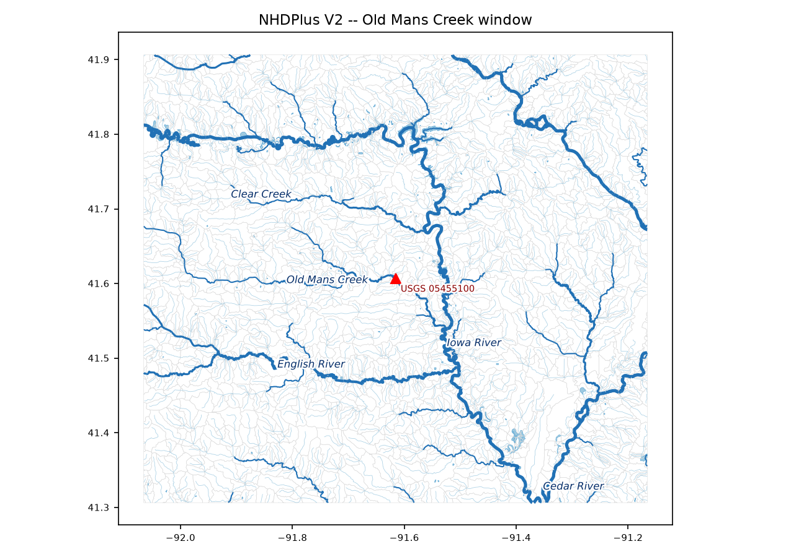
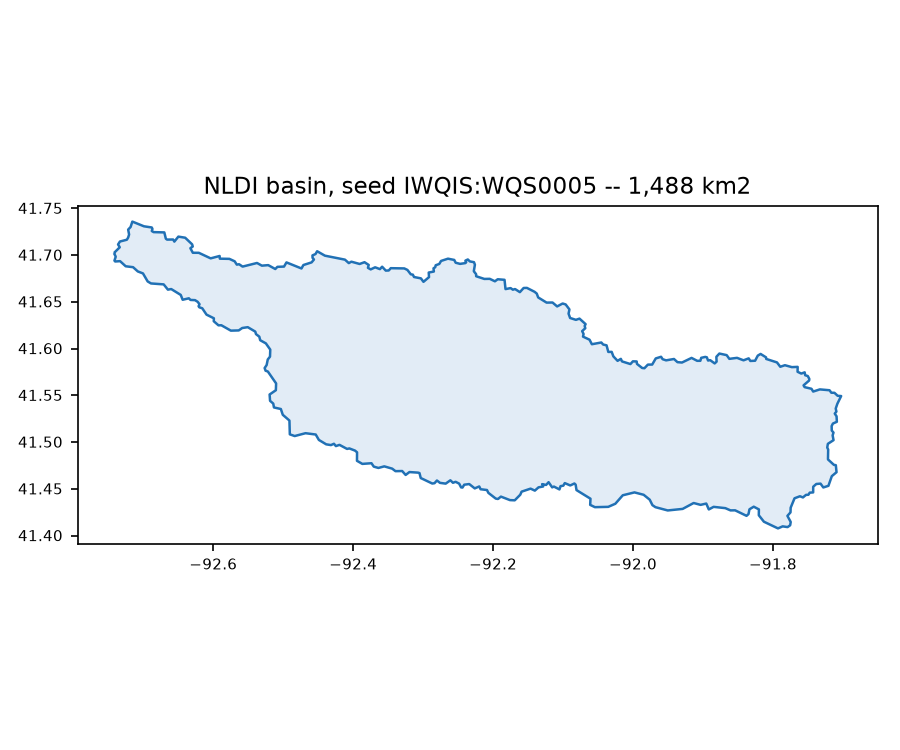
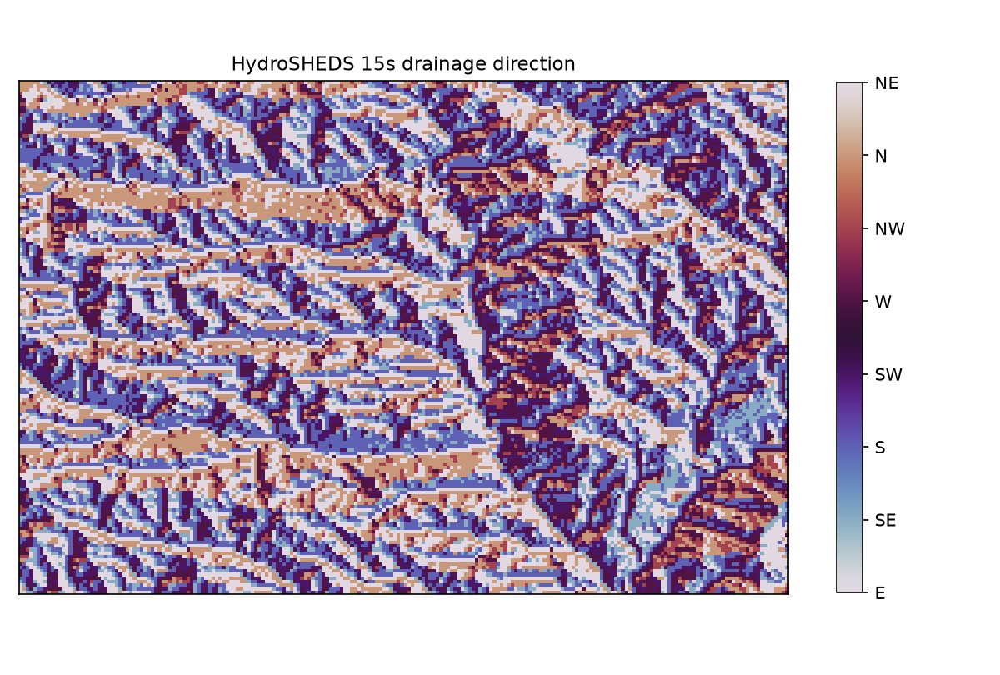
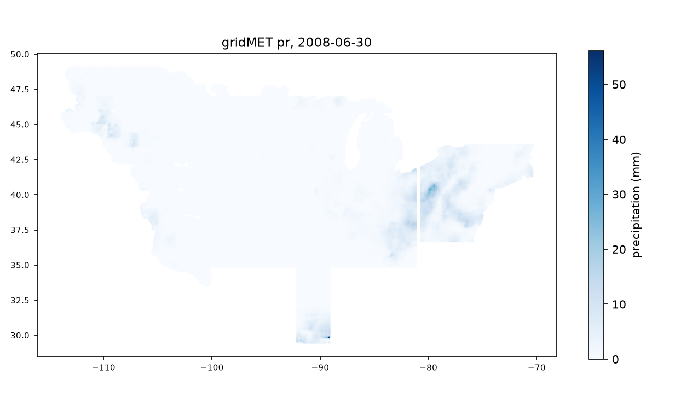
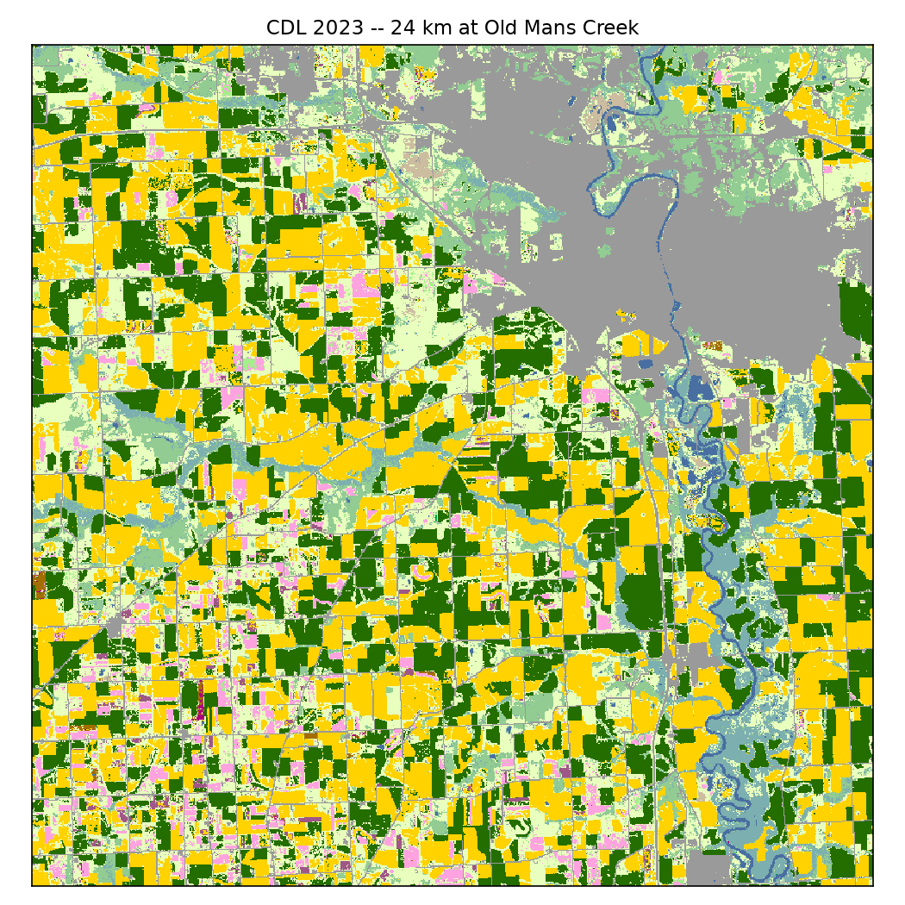
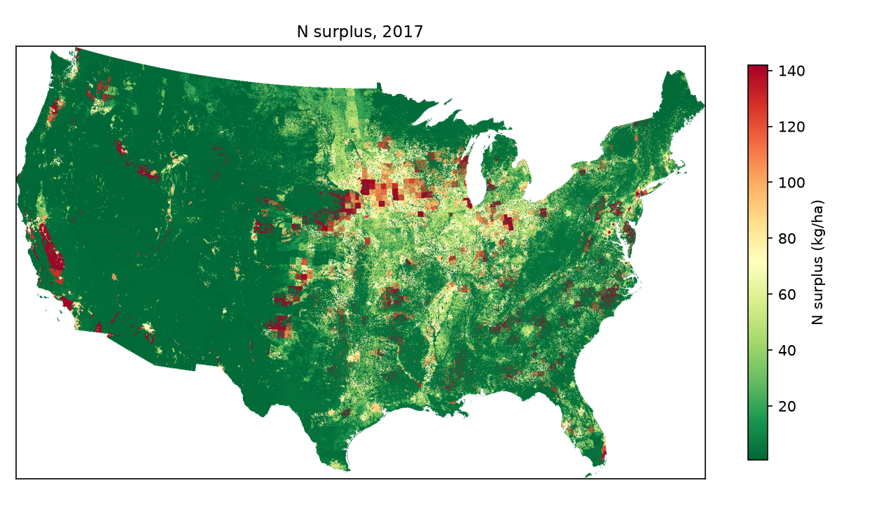
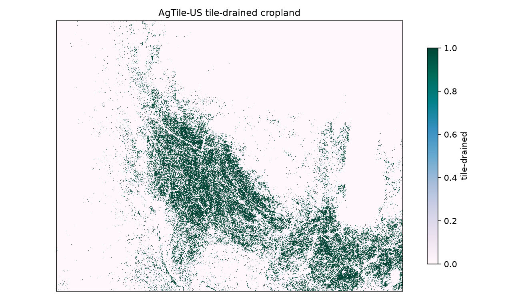

# Data Inventory

This chapter is a complete accounting of every external data source the project consumes: what each one is, who publishes it, what we take from it, in what form and at what grain, how it is acquired, and what is strange about it. Sources are grouped by their role in the data pipeline (a later chapter).

Every source lands in one of three acquisition classes, developed at the end of the chapter: **API archives** (pulled programmatically, snapshot-manifested, recoverable by re-fetch), **bulk archives** (one-time large downloads kept whole), and **vendored files** (obtained manually — a browser click or an emailed export — and kept in the tree as the authority). The class answers the most practical inventory question: what happens if we lose this?

## The master table

One row per source. The window column gives the span the build actually requests, not the span the source offers; the collection window opens 2008-01-01 (`parameters/scope.toml`) and has no upper bound.

| source | provider | role | form | grain | window used | class | consumed by |
|---|---|---|---|---|---|---|---|
| USGS water data | USGS | water records | point time series | native (IV) + daily (DV) | 2008– | API | a2/a3 → d2 |
| IWQIS | IIHR, U. Iowa | water records | point time series | ~15 min | 2008– | vendored | a2/a3 → d2 |
| MPCA CSG | Minnesota PCA | water records | point time series | minute-grain | 2008– | vendored | a2/a3 → d2 |
| NHDPlus V2 | USGS/EPA | hydrography | lines, polygons, tables | medium-res (1:100k) | static | bulk | a3 → everything |
| NLDI | USGS | hydrography | basin polygons | per query | static | API | a1; basin editor |
| HydroSHEDS DIR | HydroSHEDS (WWF et al.) | hydrography | raster | 15 arc-sec | static | bulk | access d8 machinery |
| gridMET | Climatology Lab, U. Idaho | weather | raster time series | 4 km, daily | 2008– | API | a3 → d5 weights |
| gridMET drought | Climatology Lab, U. Idaho | weather | raster time series | 4 km, **pentad** | 2008– | API | a3 → access |
| CDL | USDA NASS | land surface | raster | 30 m, annual | water-record span | bulk | d5 crops |
| gTREND-Nitrogen | Chang et al. (PSU/Waterloo) | land surface | raster | 250 m, annual | 2000–2017 | vendored | d5 nutrients |
| AgTile | AgTile-US | land surface | raster | 30 m, static | static | bulk | d5 agtile |
| StreamCat | EPA | attributes | tabular by COMID | catchment + watershed | latest vintage | API | a3 attributes |
| StreamCat N series | EPA | attributes | tabular by COMID | catchment + watershed | 1987–2016 | API | a3 attributes |
| Sekellick & Sherr | USGS | attributes | tabular by COMID | catchment | 2002/07/12/17 | bulk | a3 attributes |
| Karst (Weary & Doctor) | USGS | attributes | polygons | 1:500k | static | bulk | d5 overlay |
| WQX | EPA / states | **discrete samples** | point results | per sample | 2008– | API | a3 → access only |
| NID | USACE | structures | points + attributes | per dam | current | API | d5 structures |
| ICIS-NPDES outfalls | EPA ECHO | structures | points | per outfall | current | API | a3 → d5 structures |
| DMR loadings | EPA ECHO | structures | tabular | annual, per permit | FY window | API | a3 → d5 structures |
| CWNS 2022 | EPA | structures | relational tables | per facility | 2022 survey | vendored | d5 structures |
| NWM retrospective | NOAA | auxiliary | reach time series | hourly, by COMID | 1979-02–2023-01 | API | **not acquired — see below** |
| HydroWASTE v1.0 | Ehalt Macedo et al. | reference | points | per plant | static | vendored | cross-check only |

## Water records

The three sensor networks that supply the observations themselves, and — kept beside them because a reader looking for nitrate observations will look here — one source that is deliberately **not** a sensor network at all. The three networks are read through source adapters with one uniform signature, and their registered cohorts together comprise the census: 20,233 registrations — 20,045 USGS, 156 IWQIS, 32 MPCA. The registry recognises 16 channels across them: nitrate, discharge, gage height, water temperature, specific conductance, three turbidity variants (FNU, NTU, unknown-unit), dissolved oxygen, pH, fDOM, chlorophyll and phycocyanin fluorescence, orthophosphate, and two canary channels (groundwater level, precipitation) carried for drift detection rather than modeling.

### USGS

*what it is:* The federal monitoring network, reached through two services — the modern waterdata OGC API (`api.waterdata.usgs.gov`: monitoring-locations, time-series metadata, and continuous/instantaneous collections) and the legacy NWIS daily-values service.

*what we take:* Station registrations over the AOE, per-series declared metadata (parameter, begin, end), and observations on every registry channel a station declares. The fetch is two-tiered by declaration: stations declaring only cheap channels get a daily-values pull; stations declaring nitrate get the full native-resolution pull, windowed because the continuous API refuses envelopes wider than ~1100 days.

*form and grain:* Point time series. Native (typically 15-minute) resolution on the continuous tier, pre-aggregated daily statistics on the DV tier — a DV day carries a mean and nothing else, a fact the canonicalisation stage must respect (no fabricated spread).

*window used:* 2008-01-01 onward, clipped per-series to the API's own declared active window — asking for years a series declares empty costs a round trip exactly like a full one.

*route and landing:* API class. Metadata and observations land as per-sensor native parquets under `acquired/water/native/`; the raw GeoJSON of every monitoring-locations response is archived under `acquired/metadata/usgs_geojson/`, because the JSON text is the only carrier of declared coordinate precision (decimal places survive in text and die in floats). Requests run under an API-key rotation ring with status-aware backoff.

*quirks:* The API answers a malformed id with HTTP 400 for the whole batch, so metadata requests are bisected on failure. Declared spans can lie in both directions — the span screen treats a declared end before the window's open as disqualifying, and nothing else. Sentinel convention: −999999 in native units. One station in the export (`WQS0127`-class cases aside — that one is IWQIS) can hold data the registry cannot see; the a4 reconciliation names such rows rather than dropping them.

*citation:* USGS Water Data for the Nation; NWIS daily values.

*sample:* the native parquet of `USGS:05465500` (Iowa River at Wapello) across a midnight boundary — columns are pcodes exactly as the API names them: `99133` nitrate and `00065` gage height at 15-minute cadence, and the `_dv` daily-values tier landing once per day (`00060_dv`, discharge, 27,500 cfs).

| datetime | 99133 | 00065 | 00010_dv | 00060_dv |
|---|---|---|---|---|
| 2019-06-10 23:30:00+00:00 | 6.22 | 19.7 |  |  |
| 2019-06-10 23:45:00+00:00 | 6.22 | 19.7 |  |  |
| 2019-06-11 00:00:00+00:00 | 6.22 | 19.7 |  | 27,500 |
| 2019-06-11 00:15:00+00:00 | 6.23 | 19.7 |  |  |
| 2019-06-11 00:30:00+00:00 | 6.22 | 19.7 |  |  |

### IWQIS

*what it is:* The Iowa Water Quality Information System, IIHR's real-time sensor network. The project holds it as a vendored export: an 87-file, 43,430,699-row CSV drop (~3.4 GB) plus a station registry (`sites.csv`), both prepared once by tracked scripts and never altered in place.

*what we take:* All 24 export columns for every station in the `WQS`/`WQP` namespaces — nitrate and the standard channels, plus instrument-validity signals (`r_exc`/`m_exc`, reference and measurement extinction from the optical nitrate sensor) that the previous build discarded. 156 registrations: 149 with coordinates, 7 carrying the coordinate sentinel.

*form and grain:* Point time series at roughly 15-minute cadence, with genuine DST-aware Central-time offsets in the source text — the stored parquets are a real Central-to-UTC conversion, not a relabel.

*window used:* 2008-01-01 onward; the export is the authority for what exists.

*route and landing:* Vendored class. The export is split once per build into per-station parquets under `acquired/water/iwqis/`; a new IIHR export is a re-run of two preparation scripts, not a code change.

*quirks:* The registry and the export disagree, and each is authoritative for a different thing — the export for observations, the registry for location; stations falling between them (`WQP0016` historically, `WQS0127` currently) are reported and ledger-acknowledged, never silently dropped. The coordinate sentinel is −99.0: seven stations are registered with null geometry rather than a false position. The `WQP` conservation-practice namespace inverts the WQS naming convention (`river` holds the watercourse, `nickname` holds what the station is). The `WQT` namespace was declined by decision — its single member is a paired-installation demo carrying 112,603 rows and no values. The export ships `params.csv` and `measures.csv` declaring units, instruments, and series spans; the pipeline deliberately reads neither, and this inventory is where that fact is on record.

*citation:* IWQIS, IIHR — Hydroscience & Engineering, University of Iowa.

*sample:* `WQS0031` — nitrate at ~15-minute cadence beside the optical sensor's own extinction diagnostics (`r_exc`/`m_exc`), the instrument-validity channels the previous build discarded.

| datetime | nitrate_con | r_exc | m_exc | temp_water | turbi_mean |
|---|---|---|---|---|---|
| 2015-12-01 18:27:54+00:00 | 11.2 | 0.387 | 1.4 |  |  |
| 2015-12-01 18:45:12+00:00 | 11.2 | 0.389 | 1.4 |  |  |
| 2015-12-01 19:00:04+00:00 | 11.1 | 0.388 | 1.4 |  |  |
| 2015-12-01 19:15:10+00:00 | 11.1 | 0.39 | 1.4 |  |  |

### MPCA

*what it is:* The Minnesota Pollution Control Agency's cooperative stream gaging (CSG) program, held as vendored per-station zip exports (`csg_{id}.zip` under `raw/water/MPCA_CSG/`) plus a site list.

*what we take:* 32 stations' full records on the channels the registry maps — nitrate, discharge, temperature, turbidity among them.

*form and grain:* Point time series at minute grain — the densest records in the census; a single station's turbidity alone contributes ~145,000 channel-cells.

*window used:* 2008-01-01 onward.

*route and landing:* Vendored class. Natives are materialised from the zips by the records stage; a fresh MPCA delivery is a file drop plus a forced re-materialisation.

*quirks:* Three sentinel conventions coexist in the exports — −999999, −99999, and 999.99 — and the third is the treacherous one, sitting inside plausible physical range for some channels; all three are declared per-source in the registry and scrubbed at the cell grain with counts kept (the measured ground truth: station 41043001 carries 49,531 turbidity sentinels and 14,631 nitrate sentinels). Coordinate precision comes from the export text, read with string dtypes so trailing zeros survive.

*citation:* Minnesota Pollution Control Agency, cooperative stream gaging data.

*sample:* `41043001` — the literal 999.99 turbidity sentinel sitting mid-record beside live nitrate and discharge, exactly the in-range fill value the registry scrub exists for.

| datetime | nitrate | turbidity | discharge | water_temp |
|---|---|---|---|---|
| 2025-07-23 18:15:00+00:00 | 5.76 | 999.99 | 810 |  |
| 2025-07-23 18:30:00+00:00 | 5.78 | 999.99 | 810 |  |
| 2025-07-23 18:45:00+00:00 | 5.77 | 999.99 | 810 |  |
| 2025-07-23 19:00:00+00:00 | 5.76 | 999.99 | 810 |  |

### WQX — discrete samples, and deliberately not sensors

*what it is:* EPA's Water Quality Exchange, reached through the Water Quality Portal: discrete nitrate results contributed by federal, state, tribal and volunteer programmes. **75,599 stations** carry nitrate across the 41 AOE states, against roughly 20,000 instrumented sensors — an order-of-magnitude change in spatial coverage.

**These are not nodes, and that is a decision rather than an oversight.** WQX stations do not enter the census, never become registrations, and appear nowhere in the proximity or identity machinery. They are a distinct *class* of observation — a bottle at a moment, not a monitored series — and admitting them as candidate nodes would have generated **42,209 merge candidates** against a review queue that has adjudicated 136 ledger masks in its life. Collecting without registering keeps the coverage and refuses the burden. A verify check enforces it: no `WQX` source may appear in the sensors table.

*what we take:* Three characteristics — `Nitrate`, `Nitrate + Nitrite`, `Inorganic nitrogen (nitrate and nitrite)`. Kjeldahl, ammonia and total-N forms are refused: they are different quantities and no factor makes them nitrate.

*name:* **WQX, not WQP.** IWQIS already owns a `WQP\d+` namespace — IIHR's *Water Quality Project* programme — so a `WQP:` prefix would put two unrelated WQPs in one store forever.

*form and grain:* Point results, one row per sample — no series, no cadence. **2,112,841 results** across 41 states.

*window used:* 2008-01-01 onward, the same collection window as the sensor networks.

*route and landing:* API class, one request per state over the collection window, landing in `acquired/wqx/`. Surfaced by `api.get_discrete_nitrate`, addressed by **location and time** rather than by a node identifier, and carrying no `site_uid` so nothing invites a join against the sensors table.

*quirks, all of them measured rather than documented upstream:*

**`zip=yes` is silently ignored** — the endpoint returns plain CSV whatever the parameter says.

**Truncated responses arrive as HTTP 200 with a valid header row and no error marker.** One Alabama query returned 3.7, then 9.5, then 14.8 MB — each parsing as perfectly good CSV — before completing at 16.7; Kansas failed four times at ~5.9 MB. Without an explicit completeness check the store would silently hold a third of a state and nothing downstream could tell. The check parses the final record rather than counting separators, because a comma tolerance loose enough to survive a quoted field is loose enough to accept a truncated row. Truncation is intermittent rather than a size limit, so the fetch retries the whole window and only falls back to three-year chunks for a state that keeps failing.

**There is no result-count header**, so a request cannot be sized before it is made; station counts are fetched instead, which is cheap.

**"Grab sample" is a state-dependent claim, and the state it fails hardest in is ours.** Across all 2,112,841 results the corpus is **84.9% `Sample-Routine`** against 7.1% `Field Msr/Obs`, so in aggregate the characterisation holds. Per state it does not: the field-measurement share has a median of **0.7%** across the 41 states with at least a thousand rows, and its maximum — **51.6%** — is **Iowa**, the project's core state, where more than half the WQX nitrate is a probe reading rather than a bottle. Alabama is 37.6% integrated vertical profiles, a cross-sectional average rather than a point. `Activity_TypeCode` is therefore carried rather than flattened: these are different instruments with different error structures, and one `nitrate_discrete` channel would have pooled them irreversibly.

Worth recording how this was got wrong twice. A single state-year (Iowa 2015, 929 rows) put Iowa's field measurements at 0.1% — the true figure is 51.6%, off by a factor of five hundred, and with the sign of the anomaly inverted: the state sampled to argue field measurements were negligible is the one state where they dominate. The correction was then itself misreported as "42% in Iowa, 54.5% in Texas", because `Location_State` holds full names and a lookup by two-letter code silently matched nothing. Texas is 0.0%. **A distribution sampled at one point is not a distribution, and a key that returns no rows is not a small number.**

**Quality-control activities are stored and excluded at read.** A field blank reads as a near-zero nitrate and would not look anomalous beside a real low reading, so the reader drops them by default — the build records what the source said, and the judgement is applied visibly rather than baked in.

*citation:* Water Quality Portal (USGS/EPA/NWQMC); EPA Water Quality Exchange.

## Hydrography and network

### NHDPlus V2

*what it is:* The medium-resolution (1:100k) national hydrography dataset — the flowline network, its value-added attribute table (VAA), the catchment polygons in one-to-one correspondence with reaches, and the waterbody polygons — distributed as the ~7.3 GB national seamless geodatabase (`nhdplus_l48`).

*what we take:* Four layers clipped to the AOE: `NHDFlowline_Network` (1,511,095 reaches), the VAA (same key set), `CatchmentSP` (1,485,343 polygons), and `NHDWaterbody` (the full layer, not a by-id subset — a graph-builder asking whether a flow path crosses a reservoir needs polygons for reaches no sensor sits on). The COMID is the project's universal spatial key: sensors snap to it, covariates aggregate over it, NWM inherits it.

*form and grain:* Vector lines, polygons, and attribute tables; static.

*route and landing:* Bulk class. One national download, layers extracted and clipped once, landing as parquets under `acquired/network/`. Published as-provided — the pipeline adds nothing to them.

*quirks:* 2.14% of reaches have no catchment and 6,659 catchments have no reach — the layer's own semantics, recorded so absence reads as expected rather than as loss. A `WBAREACOMI` may reference an `NHDArea` wide-river polygon rather than an `NHDWaterbody`, and then resolves to nothing by design. Coastline reaches are non-drainage and excluded from accumulation.

*citation:* NHDPlus Version 2 (USGS/EPA); McKay et al., NHDPlus Version 2 User Guide.

*sample:* a 0.9°x0.6° window at Old Mans Creek, IA — 2,341 flowlines (width by stream order), 2,309 catchment boundaries in gray, 173 waterbodies including the Iowa River's Coralville reservoir; the red triangle is gauge USGS 05455100.

### NLDI

*what it is:* The USGS Network-Linked Data Index, a web service answering network navigation and basin delineation queries keyed on the NHDPlus network.

*what we take:* Upstream basin polygons for the seed sensors — the basins whose union with the seed boxes defines the AOE. The basin editor also makes a sanctioned live NLDI call as its `basin0` reference method.

*form and grain:* One polygon per query; static.

*route and landing:* API class; seed basins land under `acquired/seed_basins/`.

*quirks:* Returns at least one self-intersecting polygon (repaired before union, a hard requirement rather than tidiness), and has returned a 5.06M km² basin for a Cape Cod site snapped onto the Mississippi — delineations above the physical ceiling of CONUS drainage (~2.97M km² at Natchez) are flagged and excluded from the extent union.

*citation:* USGS Hydro Network-Linked Data Index.

*sample:* the delineated upstream basin for seed `IWQIS:WQS0005` (English River), 1,488 km² — one API answer, boundary as returned.

### HydroSHEDS drainage direction

*what it is:* The HydroSHEDS v1 15 arc-second Drainage Direction (DIR) raster for North America — a D8 flow-direction grid derived from conditioned SRTM elevation.

*what we take:* The DIR raster clipped to the covariate bounding box (`flowdir_15s.tif`), the substrate for the access layer's D8 flood-fill basin machinery (the basin editor's `basin3`).

*form and grain:* Raster, 15 arc-sec (~450 m); static.

*route and landing:* Bulk class, manual download from hydrosheds.org, landing at `raw/basins/hydrosheds/flowdir_15s.tif` — an immutable raw delivery, not a cache.

*quirks:* **A missing raster raises, and that is deliberate.** It replaced a legacy 500 m Iowa-only PNG on a different (numeric-keypad) D8 encoding, auto-downloaded from IWQIS — so while the fallback existed, an absent GeoTIFF silently swapped the continent for one state and one flow algorithm for another, and every downstream basin still computed, plausibly and wrongly. The fallback is gone; `load_direction_array` now refuses rather than substituting.

*citation:* Lehner, Verdin & Jarvis (2008), HydroSHEDS.

*sample:* the D8 direction codes over the same window as the NHDPlus figure — each ~450 m cell drains to one of eight neighbors, and the flood-fill basin machinery walks this field upstream.

## Weather

### gridMET

*what it is:* Daily ~4 km (1/24°) gridded surface meteorology for CONUS, 1979–present, from the Climatology Lab at the University of Idaho.

*what we take:* Eleven variables — precipitation, min/max temperature, min/max relative humidity, specific humidity, wind speed, shortwave radiation, vapor pressure deficit, and both reference evapotranspirations (grass and alfalfa) — over the AOE, tiled rather than pulled as one bounding box (the AOE's bounding box is 8.4M km² against a 4.28M km² polygon; more than half of an untiled transfer would be masked away on arrival).

*form and grain:* Raster time series, 4 km daily, float32 (the source's precision does not justify eight bytes).

*window used:* 2008-01-01 onward, accumulated quarterly.

*route and landing:* API class, but through the NCSS endpoint directly (`thredds.northwestknowledge.net`) rather than through `pygridmet` — the library retries any response containing NaN on the assumption of corruption, and gridMET is CONUS-land-only, so NaN is the *correct* value over the Great Lakes and the ocean; every box we ask for contains water. Landing as quarterly parquets under `acquired/weather/`.

*quirks:* The NaN-over-water behavior above is the load-bearing one. The grid is fixed, so catchment weights against it are computed once in d5 and closed under global cell conservation.

*citation:* Abatzoglou (2013), gridMET.

*sample:* one day of one variable — precipitation on 2008-06-30 over the AOE's 231,080 cells; the faint rectangular seams are the acquisition tiles, and the AOE silhouette is the polygon the tiling exists to respect.

### gridMET drought indices

*what it is:* Twenty-five standardized drought and water-balance aggregates from the same Climatology Lab production as gridMET itself, on the **same 1/24° lattice** — verified against the endpoint to identical corner coordinates, which is why `grid.parquet` and `weights_gridmet.parquet` work against them unchanged.

*what we take:* All of them. `spi`, `spei` and `eddi` at each published accumulation window, plus `pdsi` and the Palmer `z` index. **`spi` publishes seven windows where `spei` and `eddi` publish eight — there is no `spi270d`**, confirmed against the catalogue and named in `drought.NOT_PUBLISHED` so nobody later "restores" it.

*form and grain:* Raster, 4 km, **pentad** — one value per five days, 73 a year.

*window used:* 2008–2026, matching the collection window. 19 year files, 4.9 GB, and every full year is exactly 16,868,840 rows (231,080 AOE cells × 73 pentads).

*route and landing:* API class, the same NCSS endpoint and bbox tiling as the daily variables, fetched a **year at a time** rather than a month — the request carries seconds of fixed cost against a payload a fifth as dense as the daily store's, so monthly requests would pay that cost twelve times for identical data. Lands in `acquired/weather/pentad/`, a sibling to `acquired/weather/daily/`.

*quirks:* **The cadence is the whole reason this is a separate store.** Landing pentad values beside daily ones would leave four of every five days null, and forward-filling to daily is a modelling preference the build has no business baking in — a consumer who wants daily can resample, but one handed a forward-filled series cannot tell it was ever pentad. `api.get_drought` therefore names its date column **`pentad_start`, not `date`**: a frame calling it `date` would join cleanly against a daily series and silently align four days in five to the wrong value, where a differently-named column makes that join fail loudly.

Every drought file also carries a companion `category` grid — a binned classification of that file's own index. It is **deliberately not stored**: keeping it would add twenty-five columns that are a deterministic function of twenty-five columns already present, which is precisely the redundancy the thematic audit exists to find.

*citation:* Abatzoglou (2013), gridMET; Palmer (1965) for PDSI and the Z index.

## Land-surface covariates

### Cropland Data Layer

*what it is:* USDA NASS's annual 30 m land-cover classification of CONUS, crop-specific.

*what we take:* Every national annual raster (`{year}_30m_cdls.tif`) within the water record's span, reduced per catchment to the long format `(comid, year, code, frac, n_px)` with coverage kept beside it. No class collapse happens at build time — the 100+ native codes survive to the access layer, where a remap is an explicit reader choice.

*form and grain:* Raster, 30 m, annual.

*window used:* The water record's span; CDL's national coverage begins 2008, which coincides with the collection window's open.

*route and landing:* Bulk class; the national zips under `raw/crops/`, reduced in d5.

*quirks:* Fractional zonal reduction — a boundary pixel contributes its area share to every catchment it touches — and the per-catchment code fractions must sum to that catchment's coverage, which is a registered closure check, not an assumption.

*citation:* USDA National Agricultural Statistics Service, Cropland Data Layer.

*sample:* a 24 km window at Old Mans Creek in NASS's own embedded palette — corn (yellow) and soybean (green) checkerboard against Iowa City's gray urban mass and the Iowa River corridor; this window is 25% corn, 20% soybeans.

### The nitrogen budget

*what it is:* Twelve components of **gTREND-Nitrogen** (v1.0, March 2026) — a 250 m, EPSG:5070, annual nitrogen mass-balance dataset for CONUS built by downscaling the county-scale TREND-Nitrogen series with gridded land-use and population data. The full dataset carries 22 components over 1930–2017, in the dataset's own units of kg-N ha⁻¹ yr⁻¹.

*what we take:* Twelve components rather than the single surplus layer, because a budget's terms are separately actionable where their sum is not — a catchment whose surplus is driven by manure is a different intervention problem from one driven by fertilizer, and a model given only the total cannot tell them apart. Atmospheric deposition (oxidized, reduced), fertilizer, fixation (agricultural, cropland, pasture), livestock (total, hogs), surplus, and crop uptake (agricultural, cropland, pasture). Reduced per catchment in d5's nutrients product (kg and kg/ha forms, at 6.25 ha per pixel): 1,485,343 catchments × 216 product-years = 320,834,088 rows.

**Two of the twelve are redundant on purpose.** `Agriculture_Fixation` is cropland plus pasture, and `Agriculture_Uptake` likewise, so both are recoverable from parts we already hold. They are ingested as **closure checks on our own zonal reduction** — the source publishes a total and its parts, and the parts must reproduce the total *through our extraction*, which is a test nothing else in d5 provides. They are checks, not covariates, and no recipe may feed a total beside its own components.

*form and grain:* Raster, 250 m, annual.

*window used:* Our archive holds 2000–2017 of the dataset's 1930–2017; 2017 is the dataset's end, not a truncated download. Joined to the water record on year downstream.

*route and landing:* Vendored class (a figshare download), staged under `raw/gTREND/<Component>/` — one directory per component, named as the dataset names it (`Surplus/Surplus_N_{year}.tif`, `Agriculture_Fertilizer/Fertilizer_Ag_{year}.tif`, and so on). The pipeline discovers components through that declaration rather than a hardcoded list, so adding one is a registry edit. The dataset README is kept at `reference/data-source-readmes/gTREND-Nitrogen_README.pdf`.

*quirks:* The surplus is a full mass balance, not fertilizer-minus-uptake — it sums fertilizer (farm and non-farm), fixation, atmospheric deposition, manure, and human waste, and subtracts crop and pasture uptake, with wastewater treatment deliberately unmodeled (human N counts as landscape-retained). The downscaling assigns each county's per-hectare rate uniformly across its agricultural cells via a binary land-use mask, so within-county variation in the raster is land-use pattern, not measured application variance — the authors state it is a watershed-scale product, not a field-scale one, which is exactly the grain we consume it at. Legacy per-tile surplus parquets from the previous build sit beside the national rasters and are consumed by nothing.

*citation:* Chang, Byrnes, Basu & Van Meter (2026), gTREND-Nitrogen — long-term nitrogen mass balance data for the contiguous United States (1930–2017), Scientific Data, doi:10.1038/s41597-026-06576-x; data doi:10.6084/m9.figshare.29897375.

*sample:* the 2017 national surplus raster, downsampled 12x — the corn belt's hotspot band reads directly off the source.

### AgTile

*what it is:* A 30 m map of tile-drained cropland for CONUS (AgTile-US), a static geospatial-model product.

*what we take:* The national raster, reduced per catchment to a tile-drained fraction in d5.

*form and grain:* Raster, 30 m, static.

*route and landing:* Bulk class, under `raw/agtile/national/`.

*quirks:* Tile drainage is arguably the single most nitrate-relevant land-surface attribute in the corn belt, and it is a modeled product, not a survey — treat its fractions as a covariate with its own error, not as ground truth.

*citation:* Valayamkunnath et al. (2020), AgTile-US.

*sample:* the clipped archive over the upper Midwest, downsampled 8x — the dense diagonal band is the tile-drained Des Moines lobe.

## Catchment attributes

### StreamCat

*what it is:* EPA's catchment-attribute compendium for the NHDPlus V2 network — hundreds of physiographic, climatic, soil, and anthropogenic metrics precomputed per COMID at catchment and watershed scope.

*what we take:* The latest year of every metric family at catchment scope, excluding metrics fitted on water-quality targets (keeping those would leak a modeled answer into the features).

*form and grain:* Tabular by COMID; static (per-family latest year).

*route and landing:* API class — `api.epa.gov/StreamCat` under the api.data.gov umbrella, which returns rate-limit headers on every response, so the remaining allowance is readable rather than inferred from failures. Landing under `acquired/attributes/`.

*what we take, second pass:* The nitrogen families are taken **again, as full annual series** rather than as a latest-vintage snapshot — eleven families over **1987–2016**, 326 catchment-scope columns and 326 watershed-scope columns across 1,478,330 reaches (7.3 GB). Two families are shorter than the other nine — `n_dep` runs 27 years and `n_tin` 29 against 30 — so a recipe joining them on a shared year index loses rows at the ends unless it names the years it wants. A nitrogen source term and its routed accumulation answer different questions, so `cat` and `ws` are both kept; and for nitrogen specifically a single vintage discards the trajectory, which is the quantity a long water record is positioned to exploit. Coverage is 1,478,330 of the 1,478,684 askable reaches — the 354 missing are reaches the service holds nothing for, which is why *absent is not zero* matters here rather than being pedantic.

*quirks:* Every one of the 1,146 attributes whose description declares a sentinel declares −9999 and nothing else, so a blanket scrub is safe *here* — and unsafe in general: `CAT_TILES_Early90s` encodes NODATA as 100, which no description states. The catalogue's year metadata is broken upstream and patched at acquisition.

**The rate limit is a fact to read, not a pattern to infer.** The api.data.gov umbrella caps requests per hourly window and reports the remaining allowance on every response, but an exceeded quota returns an error with an **empty body** — which presents as an unexplained death two thirds of the way through a long pull. The fetch therefore reads the header, states its budget before spending hours, and waits out an exhausted window rather than retrying into it, since a backoff against a quota spends the scarce resource faster to fail sooner. Batch size is a quota decision rather than a tuning one: at 500 COMIDs a request the full pull needs 2,958 requests against a budget of 1,000 and could not have completed on any run, while cost per request is near flat to 5,000.

**A coverage check that counts rows cannot see a missing column.** Twelve requested metrics were absent from the store for months with nothing noticing, because every COMID had a row and the check was satisfied by row count. Coverage must be tested on every axis the request names — keys *and* columns.

*citation:* Hill et al. (2016), The Stream-Catchment (StreamCat) Dataset.

*sample:* four of the ~1,146 fetched metrics for four catchments — agricultural drainage percentage, nitrogen surplus, lithological N, high-slope imperviousness.

| comid | pctagdrainagecat | nsurpcat | rockncat | pctimpslphigh2019cat |
|---|---|---|---|---|
| 10944 | 0 | 886 | 23.6 | 0.09 |
| 10946 | 0 | 1.62e+03 | 31.1 | 0.49 |
| 10948 | 0 | 1.72e+03 | 43.8 | 0 |
| 10950 | 0 | 2.91e+03 | 75.6 | 0.13 |

### Sekellick & Sherr — confined vs unconfined manure

*what it is:* County fertiliser and manure estimates already downscaled to NHDPlus COMID (DOI 10.5066/P9WDBIXC), four USDA Census years.

*what we take:* The three nitrogen files only — confined manure, unconfined manure, fertiliser. The release ships nine (a phosphorus triplet and two delivered variants beside them), so **279 MB of 728**.

*why this one and not its relatives:* Brakebill & Gronberg and Gronberg & Arnold are *upstream* of gTREND rather than independent, so ingesting them adds one measurement twice. What this release uniquely carries is the **confined versus unconfined split** — CAFO against pasture — which nothing else on disk provides at COMID grain, and which matters because the thematic audit found `livestock_hogs` one of only two nutrient components carrying signal the rest of the pool does not already imply.

*form and grain:* Tabular by COMID; 1,485,343 AOE reaches, twelve columns.

*quirks:* Four census years only, ending **2017**, because the underlying Census is five-yearly. Like everything in this family it stops well short of a water record running to 2026 — a slowly-varying descriptor, never contemporaneous, and the gap is structural rather than a consequence of what we asked for.

### Karst — Weary & Doctor

*what it is:* Carbonate and evaporite units for the conterminous US (USGS OFR 2014-1156), classified by **burial depth**: `E` at or near the surface, `B1`–`B3` buried at increasing depth.

*why burial depth is the point:* StreamCat's `pctcarbresid` reports carbonate *residual material*, so a carbonate aquifer under forty feet of glacial till scores zero — while being exactly the cover-collapse setting that routes nitrate to groundwater with almost no attenuation. Our AOE straddles the glacial margin, which is where that distinction lives and where a residual measure is most misleading.

*what we take:* Per-catchment **fractions** by class, for carbonate and evaporite. Fractions rather than flags: a catchment is rarely wholly karst, and a boolean would discard the difference between 5% underlain and 95%. Areas are computed in the map's own equal-area projection rather than reprojecting the source into ours.

*form and grain:* Polygons overlaid to catchments; 1,478,528 catchments, **422,749 (28.6%) carrying some karst**.

*route and landing:* Direct download from the publication's own directory — **which returns 403 to a default user agent**, a failure that presents as a missing file rather than a header problem. Raw zip in `raw/karst/`, overlay in `derived/covariates/karst.parquet`.

*quirks:* `carbonate_B1_frac` and `evaporite_B1_frac` are **zero across the whole AOE**. B1 polygons exist nationally (467 of them, 121,164 km²) but none intersect an AOE catchment. The columns are kept rather than dropped, because their emptiness is a fact about our region rather than about the source, and a widened extent could reach them.

*measured, not assumed:* The original justification — "no substitute on disk" — was a search for the *word* karst, and the Wieczorek Hydrologic theme arrived afterwards carrying the flow-pathway partition karst is meant to predict. Tested directly: regressing each karst fraction on the entire Hydrologic partition plus `pctcarbresid`, over 153,953 catchments, gives **R² of 0.001 to 0.100**. None of it is reconstructible. The two describe different things — Hydrologic models how water moves, karst records what the rock is and how deeply buried — and `pctcarbresid` predicts buried carbonate at R² = 0.04, which is the original argument confirmed rather than restated.

## Structures

### National Inventory of Dams

*what it is:* The US Army Corps of Engineers' registry of dams, with location, size, purpose, and completion year.

*what we take:* The national geopackage over the AOE; dams become a snapped point layer `(comid, snap_pos_m, snap_dist_m)` on the flowline network in d5, joined to nothing at build time — where a dam sits relative to a sensor is the access layer's question.

*form and grain:* Points with attributes; current registry state.

*route and landing:* API class (`nid.sec.usace.army.mil/api/nation/gpkg`), under `acquired/attributes/`.

*quirks:* Dams cluster on catchment boundaries — they impound the pour points that define them — so catchment membership alone misstates which reach a dam controls; the snapped position is the usable fact.

*citation:* USACE National Inventory of Dams.

*sample:* the four largest impoundments in the AOE by storage (acre-feet) — the Missouri main-stem giants the Missouri arm of the extent drains through.

| name | riverName | yearCompleted | nidHeight | nidStorage | primaryPurposeId |
|---|---|---|---|---|---|
| Soo Locks | St Mary S | 1921 | 17 | 277,540,000 | Navigation |
| Garrison Dam | Missouri River | 1953 | 210 | 26,000,000 | Hydroelectric |
| Garrison Dam - Williston Levee | Missouri River | 1953 | 28 | 26,000,000 | Flood Risk Reduction |
| Oahe Dam | Missouri River | 1966 | 245 | 23,600,000 | Flood Risk Reduction |

### ICIS-NPDES outfalls

*what it is:* EPA ECHO's national layer of permitted point-source outfalls — the locations where NPDES-permitted facilities discharge.

*what we take:* The outfall points over the AOE, snapped to the flowline network in d5 (500 m snap ceiling) and keyed by NPDES permit number — the join key that connects them to loadings and to CWNS attributes.

*form and grain:* Points; refreshed weekly upstream.

*route and landing:* API class (`echo.epa.gov/files/echodownloads/npdes_outfalls_layer.zip`), under `acquired/facilities/`.

*quirks:* One permit fans out to multiple outfalls; the permit, not the point, is the entity everything else joins on.

*citation:* EPA Enforcement and Compliance History Online (ECHO), ICIS-NPDES.

*sample:* the Iowa City outfalls — note the south treatment plant sits 7 km downstream of the Old Mans Creek confluence, inside the window the other figures show.

| npdes_id | facility_name | facility_type | state | lat | lon |
|---|---|---|---|---|---|
| IA0063274 | IOWA CITY REGENCY MOBILE HOME PARK STP | COR | IA | 41.6063 | -91.5355 |
| IA0070866 | IOWA CITY, CITY OF (SOUTH) STP | CTG | IA | 41.6057 | -91.5216 |
| IA0076082 | IOWA CITY WATER TREATMENT PLANT | CTG | IA | 41.6942 | -91.5494 |

### DMR nitrogen loadings

*what it is:* Discharge Monitoring Report data — the self-reported effluent measurements NPDES permittees file — published by ECHO as raw annual archives per fiscal year.

*what we take:* Nitrogen-parameter rows only, filtered from each `npdes_dmrs_fy{year}.zip` at acquisition; the full archives are ephemeral (downloaded, filtered to `dmr_n/fy{year}.parquet`, discarded) because holding every parameter for every permit is ~9 GB per sweep for rows the project will never read.

*form and grain:* Tabular, annual by fiscal year, per permit and outfall.

*window used:* The fiscal years overlapping the collection window.

*route and landing:* API class; the filtered parquets under `acquired/facilities/dmr_n/`.

*quirks:* Self-reported data with all that implies — units and parameter spellings vary by state program, and the ephemeral-filter word list is a declared parameter of the acquisition, not a hidden constant.

*citation:* EPA ECHO, DMR data downloads.

*sample:* fy2010 nitrogen-family rows for one Iowa permit — the parameter and unit vocabulary ("per cfs of streamflow", lb/CFS/d) is the state-program variety the quirks paragraph warns about.

| EXTERNAL_PERMIT_NMBR | PERM_FEATURE_NMBR | PARAMETER_DESC | DMR_VALUE_NMBR | DMR_UNIT_DESC | MONITORING_PERIOD_END_DATE |
|---|---|---|---|---|---|
| IA0003328 | 001 | Nitrogen, ammonia per cfs of streamflow | .146 | lb/CFS/d | 10/31/2009 |
| IA0003328 | 001 | Nitrogen, ammonia per cfs of streamflow | .0706 | lb/CFS/d | 10/31/2009 |
| IA0003328 | 001 | Nitrogen, ammonia per cfs of streamflow | .011 | lb/CFS/d | 11/30/2009 |
| IA0003328 | 001 | Nitrogen, ammonia per cfs of streamflow | .02 | lb/CFS/d | 11/30/2009 |

### Clean Watersheds Needs Survey 2022

*what it is:* EPA's quadrennial census of publicly-owned treatment works (POTWs): treatment level, design flow, population served.

*what we take:* A facility table assembled from the survey's relational tables — `FACILITY_PERMIT` (the NPDES join key), `FACILITIES` (name), `EFFLUENT` (current treatment level), `FLOW` (design flow, MGD, summed per facility), `POPULATION_WASTEWATER` (2022 residential population served) — 17,596 NPDES-permitted facility rows, of which ~13,850 carry treatment level and ~13,820 design flow. Joined onto the snapped outfalls by permit number in d5.

*form and grain:* Relational tables; one survey year (2022).

*route and landing:* Vendored class — the national zip is a manual portal download, kept at `acquired/facilities/vendor/cwns_national.zip`.

*quirks:* The 2022 release is relational where prior releases were flat; nothing about the schema is stable across survey years, and the next CWNS is a re-derivation, not an append.

*citation:* EPA Clean Watersheds Needs Survey 2022.

*sample:* the four largest Iowa POTWs in the assembled table.

| npdes_id | facility_name | treatment_level | design_flow_mgd | population_2022 |
|---|---|---|---|---|
| IA0044130 | DES MOINES METRO WRA WWTP | Advanced | 268 | 748,123 |
| IA0042641 | CEDAR RAPIDS WWTP | Advanced | 56 | 165,738 |
| IA0043052 | DAVENPORT WWTP | Secondary | 52 | 132,801 |
| IA0043095 | SIOUX CITY WWTP | Secondary | 29.6 | 94,220 |

## Auxiliary and reference

### NWM retrospective

*what it is:* NOAA's National Water Model v3.0 retrospective — modeled hourly streamflow for every NHDPlus reach, 1979-02 through 2023-01, as a public zarr store on S3.

*what we take:* Hourly flow for the snapped reaches of record-bearing sensors (the `sensor_comids.txt` parameter file), aggregated and partitioned per COMID. `feature_id` *is* the COMID — NWM inherits NHDPlus's identifiers, so it joins everything else here with no crosswalk.

*form and grain:* Reach time series, hourly, by COMID.

*window used:* The full retrospective; it is a fixed product, so a COMID on disk is final.

*route and landing:* API class (anonymous S3, `noaa-nwm-retrospective-3-0-pds`), partitioned under `acquired/nwm/comid={comid}/`.

*quirks:* **NOT acquired, and the decision is evidence-backed rather than deferred.** The store is empty and stays that way. A regionalised discharge model built from data already on disk — gridMET, StreamCat, the flow network — was scored against NWM's own measured skill on our reaches and beat it on four of five metrics: median per-site NSE **0.509 against 0.35**, log-NSE 0.585 against 0.521, correlation 0.787 against 0.701, bias 1.007 against 1.023. NWM won only on Kling-Gupta (0.646 against 0.529).

The comparison favours NWM at every turn and it still loses: its figure comes from gauges it was **calibrated against**, ours from basins the model had never seen, and gauged skill is a ceiling on ungauged skill. So NWM's real number where we would use it — the 158 nitrate records with no gauge — sits below 0.35. Those records now carry a modelled series from the in-house model instead. See `notes/reports/discharge_model_report.md`.

**What would reopen it:** KGE is the metric that punishes a damped hydrograph, and a boosted-tree regression damps one where a routed physical model does not. If a downstream task depends on flow *variability* rather than level and timing, that gap is the argument — as its own project, not a source appended here.

*citation:* NOAA National Water Model v3.0 retrospective.

*sample:* none — nothing is acquired. The empty `acquired/nwm/` directory is a placeholder from the build that anticipated it.

### HydroWASTE v1.0

*what it is:* A published global inventory of ~58,500 wastewater treatment plants with locations, population served, and estimated discharge, from the paper's supplementary data.

*what we take:* Nothing into the pipeline. It exists as an independent reference against which our ICIS outfall snapping is cross-checked — HydroWASTE outfalls joined to ours within 1 km, separation distributions reported, disagreements over 500 m audited (`notes/facilities-snapping-report.md`).

*form and grain:* Points; static.

*route and landing:* Vendored class — the CSV is a manual download (the host serves 202s to non-browser clients), kept under `reference/water-treatment-facilities/` beside the source PDFs.

*quirks:* Reference-only by design; promoting it to a pipeline input would circularise the cross-check.

*citation:* Ehalt Macedo et al. (2022), HydroWASTE.

*sample:* the Iowa rows — the Iowa City South plant here is the same facility as ICIS permit IA0070866 two sections up, which is precisely the join the cross-check exercises.

| WASTE_ID | WWTP_NAME | LAT_OUT | LON_OUT | POP_SERVED | WASTE_DIS |
|---|---|---|---|---|---|
| 28761 | IOWA CITY SOUTH WWTP | 41.5350 | -91.5270 | 60780 | 11356.2350 |
| 28762 | IOWA FALLS WWTP | 42.5150 | -93.2480 | 5193 | 10337.9600 |
| 29207 | IOWA GREAT LAKES WWTP | 43.3100 | -95.1770 | 23637 | 7078.7200 |
| 30148 | IOWA SEWERAGE SYSTEM | 30.2480 | -93.1270 | 2588 | 1135.6240 |

## Data Themes

The sections above are organised by **where data comes from** — a source at a time, with its grain, span and quirks. This section reorganises the same holdings by **what they are about**, and exists to answer a question the source-by-source view cannot: *what does this project not see at all?*

**The themes are enumerated from the domain, not from our holdings.** That distinction is the whole design. A list derived from the data we happen to have would give every theme members by construction and could never reveal a gap; these are the things that govern nitrate in a watershed, and our sources are slotted into them afterwards. **A theme that comes up empty or thin is the finding, not an omission from the list.** Someone who knows this domain should be able to read the table below and immediately name something we have nothing under — that is what it is for.

The numbers are generated: `python -m data.insights` writes `data/insights/report.md` after any pipeline run, and this section is the hand-written interpretation of it. Where the two disagree, the report is current and this is stale.

### The fifteen themes

| theme | coverage | what it holds |
|---|---|---|
| Meteorological forcing | good | gridMET daily, 16 variables |
| **Antecedent moisture & snow** | **thin** | gridMET pentad drought — 25 aggregates, acquired; still one source, SNODAS would be the second |
| Nitrogen inputs | good | gTREND components, StreamCat annual families, Sekellick confined/unconfined manure, Wieczorek chemical, DMR loads |
| Nitrogen sinks & uptake | adequate | gTREND uptake, crop composition as proxy |
| **Legacy nitrogen & soil storage** | **thin** | StreamCat `n_leg` alone |
| Crops & land cover | good | CDL annual, Wieczorek land cover |
| Artificial drainage | adequate | AgTile, Wieczorek `TILES92`/`DITCHES92`, StreamCat |
| Surface hydrology & flow | good | NHDPlus VAA, measured discharge, modelled discharge for 110 ungauged nitrate sites; NWM refused on evidence |
| Groundwater & residence time | improving | Wieczorek `Hydrologic` — recharge, water-table depth, baseflow index, contact time |
| **In-stream processing & attenuation** | **thin** | VAA travel time, dams, waterbodies — all present, none yet derived into a residence-time covariate |
| Soils & geology | good | Wieczorek soils and geology, StreamCat STATSGO, karst by burial depth (28.6% of catchments) |
| Physiography & regions | good | Wieczorek `Regions` — HLR, Fenneman, ecoregions |
| Point sources & structures | good | DMR monthly loads, ICIS outfalls, CWNS, NID dams |
| **Conservation practices** | **thin** | Wieczorek BMP (13 attributes); OpTIS refused on resolution |
| Water-quality observations | good | USGS, IWQIS, MPCA continuous; WQX discrete collected — 2.11M results, never registered as nodes |

### What the thin themes actually mean

Five themes read thin, and the reason differs in every case — which is why the generated report gives one per theme rather than a single sentence. Only two of the five are acquisition problems, and only one of those is fixable:

- **In-stream processing** is thin because nothing has been *derived*, not because data is missing. Reservoir residence time is computable today from NID dams, NHDPlus waterbodies and VAA travel time — all three are on disk. Stream temperature, which denitrification depends on, arrives with the StreamCat series pull (`mast2014`, `msst2014`, `mwst2014`).
- **Groundwater and residence time** was thin until the `Hydrologic` theme was added; the flow-pathway partition it carries is the single most direct description of *how* water reaches a reach that the project has. It reads thin only because the count is one.
- **Antecedent moisture and snow** is thin by count rather than by content: the one source is the pentad drought store, 25 aggregates across `spi`/`spei`/`eddi`/`pdsi`/`z`, and it is the **only sub-annual covariate the project holds besides daily gridMET**. SNODAS is the acquisition that would make it two, and it is deferred rather than refused.
- **Conservation practices** is a genuine observational gap, and an unfixable one at our grain: the best available product (OpTIS) is published only at HUC8, which is closer to a basin grouping than a covariate, and would leak rather than inform.
- **Legacy nitrogen** is the one where an acquisition helps, and it landed: StreamCat's `n_leg` runs annually **1987–2016** rather than as the single snapshot the vintage collapse was reducing it to.

The count-based rating is worth reading sceptically for a second reason. A theme with one source cannot have a redundancy matrix, so **thin themes are exactly the themes whose adequacy is unmeasurable** — the rating says "we cannot check this one against itself", not "this one is weak."

### Do not double-count

Sources that look independent and are not. **No statistic can find these** — two datasets sharing an ancestor correlate exactly as well as two good independent measurements would, so this list is traced by reading documentation and is the reason `lineage` is a column in the generated report.

| these agree because | pair |
|---|---|
| the same TREND county fertilizer estimates | StreamCat `n_ff` ↔ gTREND `Agriculture_Fertilizer` |
| the same TREND livestock inventories | StreamCat `n_lw` ↔ gTREND `Lvst_Sum` |
| AgTile is *derived from* SSURGO drainage class and slope | AgTile ↔ Wieczorek soils / topographic |
| exact arithmetic sums, verified to 0.01 | gTREND `fixation_ag` = `fixation_cropland` + `fixation_pasture`; likewise uptake |
| a subset, not a partner | gTREND `Lvst_Hogs` ⊂ `Lvst_Sum` |

### What to use when

**For a spatially-resolved covariate, resolution stops mattering above about 1 km.** Measured over all 1,478,688 catchments (median area 1.38 km²), the share smaller than a single source cell is 40.7% for AORC at 1 km, 98.4% for TerraClimate at 4 km, 98.8% for gridMET, and 100% for NLDAS-2. Anything coarser than roughly a kilometre delivers a **catchment-level constant**, whatever it advertises — so choose those sources on cadence, variables and provenance, never on grid spacing.

**For nitrogen inputs, prefer StreamCat's catchment-grain series to gTREND's rasters** where both offer the quantity: gTREND downscales county totals by an agricultural mask and therefore carries no sub-county information, so its catchment mean is an area-weighted county mean — which StreamCat already delivers, COMID-keyed and annual. gTREND's unique contribution is *composition*: manure by animal class, oxidized versus reduced deposition, cropland versus pasture splits.

**And gTREND's eighteen annual layers are, for eleven of twelve components, a static map plus a year term.** Decomposing the catchment × year panel over a 20,000-catchment sample, the interaction share — the only part that is genuinely spatiotemporal, and the only part a model cannot get from a static covariate beside a year dummy — is **0.6% for reduced deposition, 2.6% for fertilizer, 3.6% for surplus, 5.2% for hogs**. The single exception is **`fixation_pasture` at 23.7%**, the one component whose annual detail earns its storage. This is not a defect and it does not contradict the source: it is what the documented downscaling *means*, measured. The mask fixes the spatial pattern and only the county-year total moves, so the annual dimension carries a national trajectory rather than local dynamics.

**Within the budget, only two components carry their own signal.** Regressing each on all the others (the two closure totals excluded, since they are their own parts summed): `uptake_cropland` is reconstructible at R² = 0.988, `fixation_cropland` at 0.974, `fertilizer` at 0.959. The exceptions are **`livestock_hogs` (0.534)** and **`fixation_pasture` (0.629)** — which sharpens the composition claim above rather than overturning it: composition is the right reason to hold gTREND, but the composition that is *informative* is narrower than twelve columns suggests, and it happens to centre on hogs, the intervention story in this AOE. Note that pairwise correlation would not have found this — two products can each correlate weakly with a third and still be jointly redundant with it, which is why the report regresses on the pool rather than tabulating pairs.

**For anything requiring a day boundary other than ours**, use `access.get_native` and bin the sub-daily samples yourself. The published record is collapsed to Central Standard calendar days, and gridMET's precipitation day sits eight hours off that — see the pipeline chapter's Weather section.

## Re-materialisation: what happens if we lose it

The three classes carry three different recovery stories, and the inventory is where each source's story is fixed:

**API archives** (USGS records and metadata, NLDI seed basins, gridMET, StreamCat, NID, ICIS outfalls, DMR, NWM) are recoverable by re-running acquisition — at the cost of time, quota, and the possibility that the source has since revised or retired data. The snapshot mechanism exists precisely because "recoverable in principle" is not "identical": every acquisition pass ends in a manifest cut, so a re-fetch that comes back different is a classified drift event, not a silent substitution.

**Bulk archives** (the NHDPlus national geodatabase, CDL national zips, AgTile, HydroSHEDS DIR) are static products recoverable by re-download, with no revision risk worth naming — but at multi-gigabyte cost, so they are kept whole and adopted across builds rather than re-pulled.

**Vendored files** (the IWQIS export, MPCA zips, CWNS national zip, the nutrient rasters, HydroWASTE CSV) are the irreplaceable class: each was obtained by a human act — a portal session, an emailed export, a browser download a script cannot repeat — and the copy in the tree is the authority. Losing one means asking a person or an agency again, possibly for data they no longer serve in the same form. These are the files backups exist for.

One residue note completes the accounting: `raw/comid_attrs/` holds attribute zips (BFI, contact time, 1992 tile drains) from the previous build, superseded by the StreamCat API and consumed by nothing — they await deletion, not documentation. Source READMEs collected from providers live under `reference/data-source-readmes/`, one per dataset that ships one.

## Not incorporated but noted

- **gTREND-Phosphorus:** [(link)](https://plus.figshare.com/articles/dataset/TREND-Phosphorus_and_gTREND-Phosphorus_-_Long-term_phosphorus_mass_balance_data_for_the_contiguous_United_States_1930-2017_/30158131) is the same thing as the gTREND-Nitrogen Surplus tifs but for phosphorus. There is no one summary tif, it's split across different tifs like Crop_P_Uptake and Farm_P_Fertilizer. Phosphorus is not a focus right now so this is omitted.